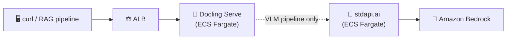

# Docling with stdapi.ai - Document Conversion API for RAG

This deployment provides [Docling Serve](https://github.com/docling-project/docling-serve), the HTTP API for [Docling](https://github.com/docling-project/docling), configured to route its vision-language model (VLM) pipeline through stdapi.ai to Amazon Bedrock.

**Docling has no web UI.** It is a document-conversion HTTP API: you `POST` a PDF or office document and get back structured Markdown/JSON, typically as the ingestion step of a RAG pipeline. This sample gives you a working `curl` command, not a browser URL.

**See full documentation:** [RAG Pipelines Integration](https://stdapi.ai/use_cases_rag/)

## What This Sets Up

- **Docling Serve**: the official `docling-serve-cpu` image, CPU-only, no GPU required
- **Default pipeline**: classical layout/OCR/table-structure extraction — does **not** call any LLM
- **VLM pipeline (opt-in per request)**: routed through stdapi.ai's OpenAI-compatible API to a vision-capable Amazon Bedrock model
- **Zero backing services**: no database, no cache, no file storage — Docling ships its models baked into the image and keeps conversion results in memory for a short TTL
- **Security**: KMS-encrypted secrets, IP-restricted ALB, API key authentication

## A note on the VLM integration

Docling's *default* conversion pipeline is classical computer vision (layout detection, OCR, table structure) and never calls an LLM. To make this sample actually exercise stdapi.ai, it also configures Docling's *optional* VLM pipeline, via `DOCLING_SERVE_CUSTOM_VLM_PRESETS`, to call a Bedrock vision model through stdapi.ai.

This is a real, working integration, but it's a rough edge in Docling Serve itself, worth knowing about: **the example in Docling Serve's own `docs/configuration.md` for this environment variable does not match the schema its server actually validates.** The JSON shape used in `terraform/docling.tf` was verified directly against the source of the pinned version (`docling-serve` v1.29.0 → `docling-jobkit` ≥3.2.0 → `docling`'s `VlmConvertOptions`/`VlmModelSpec`/`ApiVlmEngineOptions` pydantic models), not against the docs. If you change the Docling Serve version, re-verify this shape against `docling_jobkit/convert/manager.py` and `docling/datamodel/pipeline_options.py` before trusting the docs.

By default (no `pipeline` specified), a request never touches stdapi.ai — see [Convert a document](#convert-a-document) below for the request that does.

## Prerequisites

1. **AWS Marketplace Subscription**: [Subscribe to stdapi.ai](https://aws.amazon.com/marketplace/pp/prodview-su2dajk5zawpo) - 14-day free trial
2. **OpenTofu**: Install [OpenTofu](https://opentofu.org/docs/intro/install/) >= 1.5
3. **AWS CLI**: Install [AWS CLI v2](https://docs.aws.amazon.com/cli/latest/userguide/getting-started-install.html)
4. **AWS Credentials**: Configure your credentials
   ```bash
   aws sso login --profile your-profile
   ```

> ⚠️ **Requires AWS administrator permissions.** This stack provisions IAM roles and
> policies, KMS keys, ECS/Fargate, ALB, and networking. A restricted developer
> profile will fail during `tofu apply`.
>
> **Strongly recommended:** deploy into a **sandbox / non-production AWS account first**
> to evaluate the stack, then replicate into your target account with scoped-down
> principals once you've validated it.

Before running `tofu apply`, confirm your active AWS identity and region
(the AWS provider reads them from your environment, not from an OpenTofu variable):
```bash
aws sts get-caller-identity
aws configure get region
```

## Get the Code

```bash
git clone https://github.com/stdapi-ai/samples.git
cd samples/getting_started_docling
```

<details>
<summary>No git? Download the ZIP instead</summary>

```bash
curl -L https://github.com/stdapi-ai/samples/archive/refs/heads/main.zip -o samples.zip
unzip samples.zip
cd samples-main/getting_started_docling
```
</details>

## Deployment

```bash
cd terraform
tofu init
tofu apply
```

After deployment (a few minutes):

```bash
# Get the Docling Serve URL
tofu output docling_url
```

## Convert a document

Docling Serve exposes `/v1/convert/source` (fetch a document by URL) and `/v1/convert/file` (upload a file). Both accept the same conversion options.

> **Another docs-vs-runtime mismatch:** `docling-serve` v1.29.0's own `docs/usage.md` documents `http_sources`/`file_sources` fields for `/v1/convert/source`, but the deployed server's actual OpenAPI schema (verified live against a running instance) requires a single `sources` array with a `kind: "http"` (or `"file"`) discriminator, as used below.

**Default pipeline** (layout/OCR, no LLM call, no stdapi.ai traffic):
```bash
DOCLING_URL=$(tofu output -raw docling_url)

curl -s -X POST "$DOCLING_URL/v1/convert/source" \
  -H 'Content-Type: application/json' \
  -d '{
    "options": {"to_formats": ["md"]},
    "sources": [{"kind": "http", "url": "https://arxiv.org/pdf/2206.01062"}]
  }' | jq -r '.document.md_content'
```

**VLM pipeline through stdapi.ai -> Amazon Bedrock** (add `pipeline` and `vlm_pipeline_preset`):
```bash
DOCLING_URL=$(tofu output -raw docling_url)

curl -s -X POST "$DOCLING_URL/v1/convert/source" \
  -H 'Content-Type: application/json' \
  -d '{
    "options": {
      "to_formats": ["md"],
      "pipeline": "vlm",
      "vlm_pipeline_preset": "stdapi_bedrock"
    },
    "sources": [{"kind": "http", "url": "https://arxiv.org/pdf/2206.01062"}]
  }' | jq -r '.document.md_content'
```

`vlm_pipeline_preset` must be the preset ID itself (`stdapi_bedrock`, set by `docling_vlm_preset_id` in `terraform/docling.tf`), not `"default"`. Verified live: `docling-jobkit` v3.2.0's preset registry always tags its synthetic `"default"` entry as a Docling built-in, so `"vlm_pipeline_preset": "default"` fails to resolve a custom preset even when `DOCLING_SERVE_DEFAULT_VLM_PRESET` names it — the request has to name the custom preset directly.

The second request has each page rendered to an image and sent to the Bedrock model configured in `terraform/docling.tf` (`anthropic.claude-haiku-4-5-20251001-v1:0` by default) through stdapi.ai's OpenAI-compatible endpoint. Watch the stdapi.ai CloudWatch logs to confirm the call went through.

To upload a local file instead of fetching a URL, use `/v1/convert/file` with `multipart/form-data` — see [Docling Serve's usage docs](https://github.com/docling-project/docling-serve/blob/v1.29.0/docs/usage.md#file-endpoint).

## Architecture Overview



## Security

### IP Address Restriction

Access is restricted to your current IP address:
- Your public IP is automatically detected during deployment
- If your IP changes, run `tofu apply` to update access

## Customization

### Region Configuration

To configure your AWS regions and compliance/sovereignty, edit `terraform/main.tf` and
adjust it to your EU or US configuration.

### VLM model

The Bedrock model used for the VLM pipeline is set in `terraform/docling.tf`:
- `docling_vlm_model` (default: `anthropic.claude-haiku-4-5-20251001-v1:0`) — must be a vision-capable Bedrock model available through stdapi.ai

### Sizing

`cpu = 1` / `memory = 8192` (MiB) in `terraform/docling.tf` matches Docling Serve's own guidance for CPU-only conversion — its `docling-serve-rq-workers.yaml` deployment example sizes the same `docling-serve-cpu` image's API container at 1 vCPU / 8 GiB. Increase `memory` further for large or image-heavy documents.

### HTTPS configuration

This sample uses the default load balancer endpoint with HTTP. To enable HTTPS on
a custom domain, set `alb_domain_name` and `alb_route53_zone_name`.

Recommended: create a `terraform.tfvars` file (auto-loaded) to manage these values, for example:
```hcl
alb_domain_name       = "docling.example.com"
alb_route53_zone_name = "example.com"
```

### Production hardening

This sample favors low cost and easy cleanup over durability. Before promoting it to production, review these deltas:

- **ALB**: access logging is not enabled and no WAF is attached. Enable ALB access logs to a dedicated S3 bucket and consider AWS WAF.
- **Container filesystem**: `read_only_root_filesystem` is not set (Security Hub ECS.5), and the container does not pin a non-root `user` (Security Hub ECS.20), matching the ECS module's defaults. Verify Docling Serve tolerates a read-only root filesystem and a non-root UID before enabling either — this has not been tested for this sample.
- **Result TTL**: conversion results live in memory for `DOCLING_SERVE_RESULT_REMOVAL_DELAY` (300 seconds by default) before expiring. Increase it if your client is slow to fetch async results.

### Microservices interconnections

This sample uses ECS with service discovery to enable communication between microservices.
"Service discovery" uses DNS and round-robin to distribute requests between microservices. This approach is cost-effective and simple.

## Cleanup

To delete all resources and stop incurring charges:

```bash
cd terraform
tofu destroy
```

## Version Compatibility

- OpenTofu >= 1.5
- stdapi.ai Terraform module ~> 1.0
- AWS Provider >= 6.27.0
- Docling Serve `v1.29.0` (`docling-serve-cpu` image)

## Additional Resources

- **[RAG Pipelines Integration](https://stdapi.ai/use_cases_rag/)** - Complete documentation
- [Docling Serve Documentation](https://github.com/docling-project/docling-serve/blob/v1.29.0/docs/usage.md)
- [Docling Serve Configuration Reference](https://github.com/docling-project/docling-serve/blob/v1.29.0/docs/configuration.md)
- [stdapi.ai Configuration Guide](https://stdapi.ai/operations_configuration/)
- [Terraform Module Documentation](https://github.com/stdapi-ai/terraform-aws-stdapi-ai)
- [Amazon Bedrock Models](https://docs.aws.amazon.com/bedrock/latest/userguide/models-supported.html)

## Troubleshooting

If you encounter errors, try re-running `tofu apply`.

- **`tofu apply` fails with AccessDenied** — your AWS profile lacks administrator permissions. See Prerequisites above.
- **`503 Service Unavailable`** — the ECS task is still starting; model loading on first boot can take a minute or two.
- **VLM pipeline request fails or times out** — check the stdapi.ai CloudWatch logs for the upstream Bedrock error; also confirm the model set in `docling_vlm_model` is enabled in your Bedrock console and available in one of `aws_bedrock_regions`.

**Full troubleshooting guide:** https://stdapi.ai/operations_troubleshooting/
