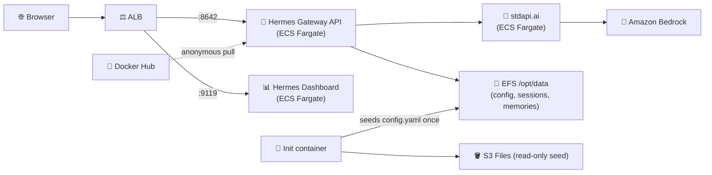

# Hermes Agent with stdapi.ai - Autonomous Agent on Amazon Bedrock

This deployment provides [Hermes Agent](https://github.com/NousResearch/hermes-agent) (Nous Research), preconfigured to run its agent loop against Amazon Bedrock models through stdapi.ai — no API keys to hunt down, no manual `config.yaml` editing before the first run.

**See full documentation:** [Autonomous Agent CLIs Use Case Guide](https://stdapi.ai/use_cases_autonomous_agents/)

## What This Sets Up

- **Hermes Agent gateway**: the OpenAI-compatible API server (port `8642`), reachable through the ALB
- **Hermes web dashboard**: the built-in monitoring UI (port `9119`), reachable through the ALB behind HTTP Basic Auth
- **Model provider**: stdapi.ai exposed as a `custom` OpenAI-compatible backend, pointed at Amazon Bedrock
- **Preconfigured `config.yaml`**: seeded into persistent storage on first boot with the internal stdapi.ai URL and API key already filled in
- **Persistent state**: Hermes' `/opt/data` (config, sessions, memories, skills, logs, `.env`) on Amazon EFS, so it survives redeployments
- **No local image build**: the Hermes image is referenced directly from Docker Hub and pulled anonymously by Fargate — nothing is built or pushed from your machine, and no upstream credential is required before `tofu apply` works
- **Interactive access**: ECS Exec enabled, so you can shell into the container or drive Hermes' interactive CLI directly
- **Security**: KMS encryption at rest, least-privilege IAM, no secrets in plaintext task-definition environment variables

## Prerequisites

1. **AWS Marketplace Subscription**: [Subscribe to stdapi.ai](https://aws.amazon.com/marketplace/pp/prodview-su2dajk5zawpo) - 14-day free trial
2. **Terraform or OpenTofu**: Install [Terraform](https://www.terraform.io/downloads) or [OpenTofu](https://opentofu.org/docs/intro/install/) >= 1.5
3. **AWS CLI**: Install [AWS CLI v2](https://docs.aws.amazon.com/cli/latest/userguide/getting-started-install.html) - used by the AWS provider for credentials and, after deployment, for `aws ecs execute-command`
4. **AWS Credentials**: Configure your credentials
   ```bash
   aws sso login --profile your-profile
   ```

No Docker or Podman is required: this sample never builds, pushes, or pulls a container image from your machine. Fargate pulls the Hermes image directly from Docker Hub.

> ⚠️ **Requires AWS administrator permissions.** This stack provisions IAM roles and
> policies, KMS keys, ECS/Fargate, ALB, EFS, S3, Secrets Manager, and
> networking. A restricted developer profile will fail during `tofu apply`.
>
> **Strongly recommended:** deploy into a **sandbox / non-production AWS account first**
> to evaluate the stack, then replicate into your target account with scoped-down
> principals once you've validated it.

Before running `tofu apply`, confirm your active AWS identity and region
(the AWS provider reads them from your environment, not from a Terraform variable):
```bash
aws sts get-caller-identity
aws configure get region
```

## Get the Code

```bash
git clone https://github.com/stdapi-ai/samples.git
cd samples/getting_started_hermes
```

<details>
<summary>No git? Download the ZIP instead</summary>

```bash
curl -L https://github.com/stdapi-ai/samples/archive/refs/heads/main.zip -o samples.zip
unzip samples.zip
cd samples-main/getting_started_hermes
```
</details>

## Deployment

```bash
cd terraform
tofu init
tofu apply
```

After deployment (a few minutes for the service and its EFS-backed config to be ready):

```bash
# Get the gateway API and dashboard URLs
tofu output hermes_gateway_url
tofu output hermes_dashboard_url

# Get the dashboard credentials
tofu output hermes_dashboard_username
tofu output -raw hermes_dashboard_password

# Get the gateway API bearer token
tofu output -raw hermes_gateway_api_key
```

Open the dashboard URL in your browser and sign in with those credentials, or point any OpenAI-compatible client at the gateway URL, authenticating with the gateway API key:

```bash
curl -s "$(tofu output -raw hermes_gateway_url)/v1/chat/completions" \
  -H "Authorization: Bearer $(tofu output -raw hermes_gateway_api_key)" \
  -H 'Content-Type: application/json' \
  -d '{"model": "hermes-agent", "messages": [{"role": "user", "content": "What is 47 times 89?"}]}'
```

## Architecture Overview



## Security

### IP Address Restriction

Access to both the gateway API and the dashboard is restricted to your current IP address:
- Your public IP is automatically detected during deployment
- If your IP changes, run `tofu apply` to update access

### Dashboard Authentication

Hermes' web dashboard refuses to bind to a non-loopback address unless an authentication provider is configured. Since this dashboard is reached through a public ALB, HTTP Basic Auth is enabled with a randomly generated password (`random_password`, delivered to the container as a Secrets Manager-backed secret, never as a plaintext environment variable). Retrieve it with `tofu output -raw hermes_dashboard_password`.

### Gateway API Authentication

The OpenAI-compatible API server is off by default and, once enabled, binds to loopback only until an API key is set — an upstream guard against exposing an unauthenticated agent endpoint. This sample enables it and generates that key (`random_password`, delivered as a Secrets Manager-backed secret), so every request through the ALB must carry `Authorization: Bearer $(tofu output -raw hermes_gateway_api_key)`.

Note that agent work dispatched through this endpoint runs with the container's own terminal and filesystem access, which is why it sits behind both the IP restriction above and this bearer token.

### Known Security Hub deltas

- **ECS.20 (non-root user) — main container**: intentionally left unset. The upstream image's entrypoint (`s6-overlay`) starts as root and drops privileges to the `hermes` user itself; forcing a non-root `user` at the ECS task level would fight that startup sequence. The init container, which bypasses the entrypoint entirely, *does* run as the non-root `hermes` user (uid/gid `10000`).
- **ECS.5 (read-only root filesystem) — main container**: left unset for the same reason — `s6-overlay` needs to write to its own runtime directories outside `/opt/data`. The init container's filesystem *is* read-only, since it only ever writes through its mounts.
- **Image provenance**: the Hermes image is pulled straight from Docker Hub, so nothing scans it on the way in. Mirroring it into a private registry — an ECR pull-through cache rule, for instance — restores that gate, at the cost of an upstream credential to configure first.

## Customization

### Region Configuration

To configure your AWS regions and compliance/sovereignty, edit `terraform/main.tf` and
adjust it to your EU or US configuration.

### Model Configuration

The default model is set in `terraform/hermes.tf` (`local.hermes_model`, default `anthropic.claude-haiku-4-5-20251001-v1:0`). Changing it and re-running `tofu apply` only affects the *seed* file — since the init container never overwrites an existing `/opt/data/config.yaml`, an already-deployed instance keeps whatever model you last set. Edit `config.yaml` directly (via ECS Exec, see below) to change the model on a running deployment, or delete the file from the EFS volume before redeploying to re-seed it.

- **Your needs**: choose a model based on your primary use case (chat, coding, tool use)
- **Regional availability**: not all models are available in all AWS regions — check [Amazon Bedrock Models](https://docs.aws.amazon.com/bedrock/latest/userguide/models-supported.html) for your region
- **Cost**: model pricing varies significantly; evaluate your workload and select the most cost-effective option

### Interactive Access

ECS Exec is enabled, so you can shell into the running container or drive Hermes' interactive CLI directly:

```bash
CLUSTER=$(aws ecs list-clusters --query "clusterArns[?contains(@, 'hermes')]|[0]" --output text)
TASK=$(aws ecs list-tasks --cluster "$CLUSTER" --query 'taskArns[0]' --output text)

aws ecs execute-command \
  --cluster "$CLUSTER" \
  --task "$TASK" \
  --container main \
  --interactive \
  --command "/bin/sh"
```

Once in the shell, run `hermes` directly against the seeded `/opt/data/config.yaml` for the interactive CLI experience.

### HTTPS configuration

This sample uses the default load balancer endpoint with HTTP. To enable HTTPS on
a custom domain, set `alb_domain_name` and `alb_route53_zone_name`.

Recommended: create a `terraform.tfvars` file (auto-loaded) to manage these values, for example:
```hcl
alb_domain_name       = "hermes.example.com"
alb_route53_zone_name = "example.com"
```

### Production hardening

This sample favors low cost and easy cleanup over durability. Before promoting it to production, review these deltas:

- **EFS and S3 Files**: the module's defaults (AWS Backup plan enabled, native EFS backups disabled) apply; review `mount_points_backup_*` variables if you need a different retention policy.
- **ALB**: access logging is not enabled and no WAF is attached. Enable ALB access logs to a dedicated S3 bucket and consider AWS WAF.
- **Dashboard exposure**: consider restricting the dashboard to a VPN/bastion or ECS Exec-only access instead of a public ALB listener, especially if HTTP Basic Auth alone does not meet your compliance bar.
- **Image provenance**: see the "Image provenance" note above if you need scan-on-pull for the Hermes image.

### Microservices interconnections

This sample uses ECS with service discovery to enable communication between microservices.
"Service discovery" uses DNS and round-robin to distribute requests between microservices. This approach is cost-effective and simple.

## Cleanup

To delete all resources and stop incurring charges:

```bash
cd terraform
tofu destroy
```

**Note**: This will permanently delete all resources including the EFS volume and Hermes' persistent state (sessions, memories, skills).

## Version Compatibility

- Terraform/OpenTofu >= 1.5
- stdapi.ai Terraform module ~> 1.0
- AWS Provider >= 6.27.0
- Hermes Agent `v2026.8.3` (`nousresearch/hermes-agent`, pinned; check [Docker Hub tags](https://hub.docker.com/r/nousresearch/hermes-agent/tags) for newer releases)

## Additional Resources

- **[Autonomous Agent CLIs Use Case Guide](https://stdapi.ai/use_cases_autonomous_agents/)** - Complete documentation
- [Hermes Agent Documentation](https://hermes-agent.nousresearch.com/docs/user-guide/docker/)
- [stdapi.ai Configuration Guide](https://stdapi.ai/operations_configuration/)
- [Terraform Module Documentation](https://github.com/stdapi-ai/terraform-aws-stdapi-ai)
- [Amazon Bedrock Models](https://docs.aws.amazon.com/bedrock/latest/userguide/models-supported.html)

## Troubleshooting

If you encounter errors, try re-running `tofu apply`.

- **`tofu apply` fails with AccessDenied** — your AWS profile lacks administrator permissions. See Prerequisites above.
- **Image pull failures** — Fargate pulls `docker.io/nousresearch/hermes-agent` anonymously; if Docker Hub's anonymous rate limit is a recurring problem in your account, mirror the image into your own registry and update `local.hermes_image` in `terraform/hermes.tf`.
- **Dashboard returns a browser auth prompt you can't get past** — confirm you're using the exact values from `tofu output hermes_dashboard_username` / `tofu output -raw hermes_dashboard_password`; both are regenerated only if you taint/replace the `random_password` resources.
- **Gateway or dashboard target group is unhealthy** — ECS tasks are still starting, or the init container has not finished seeding `config.yaml` yet; health checks take a few minutes on first boot.
- **`config.yaml` was not seeded** — check the `init` container's logs in CloudWatch (`/ecs/<name-prefix>-hermes/init`); it only writes the file when `/opt/data/config.yaml` is absent, so a prior partial deployment can leave an unexpected file in place.
- **`aws_s3files_mount_target` fails to create** — S3 Files, which seeds `config.yaml`, is not offered in every availability zone, and no API lists the ones that are. Set `mount_points_s3_files_subnets_ids` on `module "hermes"` in `terraform/hermes.tf` to the subset of `module.vpc.subnets_ids` whose zones support it; the service keeps running across all of them.

**Full troubleshooting guide:** https://stdapi.ai/operations_troubleshooting/
