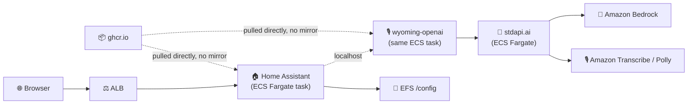

# Home Assistant + wyoming-openai with stdapi.ai - Voice Assistant on AWS

This deployment runs Home Assistant on AWS ECS Fargate, with [wyoming-openai](https://github.com/roryeckel/wyoming_openai) bridging its Assist voice pipeline to stdapi.ai's OpenAI-compatible audio routes: Amazon Transcribe for speech-to-text, Amazon Polly for text-to-speech.

**See full documentation:** [Home Assistant Voice Integration](https://stdapi.ai/use_cases_home_assistant/)

> ⚠️ **This sample runs Home Assistant itself on AWS Fargate**, which has no route to your home network: Zigbee/Z-Wave USB dongles, mDNS device discovery and other LAN-only integrations do not work in it. Use it to try Assist voice through Amazon Transcribe and Polly, or as a starting point for a cloud-reachable instance you administer through the web UI. If you already run Home Assistant at home, keep it there and deploy only the cloud-side pieces — see [Using It From a Home Assistant You Already Run](#using-it-from-a-home-assistant-you-already-run).

## What This Sets Up

- **Home Assistant** (`ghcr.io/home-assistant/home-assistant:2026.7.4`) on ECS Fargate, config on a persistent EFS volume
- **wyoming-openai** (`ghcr.io/roryeckel/wyoming_openai:0.5.0`) as a second container in the *same* ECS task, reached by Home Assistant over `localhost` — no service discovery needed
- **stdapi.ai** as the internal OpenAI-compatible backend wyoming-openai talks to, for `amazon.transcribe` (STT) and `amazon.polly-neural` (TTS)
- **Both images referenced directly from ghcr.io** and pulled by Fargate itself — nothing is built, pushed, or mirrored from your machine, and no registry credentials are needed
- **ALB with HTTPS-capable listener**, restricted to your current public IP
- **Security**: KMS encryption for storage, ECS Exec enabled for debugging, least-privilege IAM

## Prerequisites

1. **AWS Marketplace Subscription**: [Subscribe to stdapi.ai](https://aws.amazon.com/marketplace/pp/prodview-su2dajk5zawpo) - 14-day free trial
2. **OpenTofu or Terraform**: Install [OpenTofu](https://opentofu.org/docs/intro/install/) or [Terraform](https://www.terraform.io/downloads) >= 1.5
3. **AWS Credentials**: Configure your credentials
   ```bash
   aws sso login --profile your-profile
   ```

No Docker or Podman is required: nothing is built or pushed from your machine. Both images are public, and Fargate pulls them from ghcr.io with no registry credentials.

> ⚠️ **Requires AWS administrator permissions.** This stack provisions IAM roles and
> policies, KMS keys, ECS/Fargate, ALB, EFS, S3, and networking. A restricted
> developer profile will fail during `tofu apply`.
>
> **Strongly recommended:** deploy into a **sandbox / non-production AWS account first**
> to evaluate the stack, then replicate into your target account with scoped-down
> principals once you've validated it.

Before running `tofu apply`, confirm your active AWS identity and region
(the AWS provider reads them from your environment, not from a Terraform variable):
```bash
aws sts get-caller-identity
aws configure get region
```

## Get the Code

```bash
git clone https://github.com/stdapi-ai/samples.git
cd samples/getting_started_home_assistant
```

<details>
<summary>No git? Download the ZIP instead</summary>

```bash
curl -L https://github.com/stdapi-ai/samples/archive/refs/heads/main.zip -o samples.zip
unzip samples.zip
cd samples-main/getting_started_home_assistant
```
</details>

## Deployment

```bash
cd terraform
tofu init
tofu apply
```

After deployment (5-10 minutes):

```bash
# Get the Home Assistant URL
tofu output home_assistant_url
```

## What's Preconfigured, and What Isn't

This sample seeds `/config/configuration.yaml` on first boot with the settings Home Assistant needs to sit behind the ALB correctly (`http.use_x_forwarded_for` and `http.trusted_proxies` — see [Reverse Proxy Configuration](#reverse-proxy-configuration) below) and enables `default_config:`, which pulls in the standard integration bundle Assist depends on. Everything else is **honestly manual**, for reasons specific to Home Assistant:

1. **Create the owner account.** Home Assistant's first-run onboarding wizard creates its one admin account interactively in the browser, hashing the password into `/config/.storage/auth` in a format the wizard itself generates. There is no supported non-interactive way to create this account, and this sample does not attempt to fake it.
   - Open `tofu output home_assistant_url`, and follow the wizard.

2. **Add the Wyoming integration.** The `wyoming` integration (the one wyoming-openai speaks to) is config-entry only — its `manifest.json` declares `"config_flow": true` with no YAML schema, so it cannot be preconfigured through `configuration.yaml` the way `http:` can. We looked at pre-seeding its config entry directly into `/config/.storage/core.config_entries` (the flow itself only needs a host and a port — see its `config_flow.py`), but storage files are an internal implementation detail with no documented cross-version compatibility guarantee, so we chose not to write to it. Two clicks fix this:
   - **Settings** → **Devices & Services** → **Add Integration** → search **Wyoming Protocol**
   - Host: `localhost`, Port: `10300`

3. **Add the Assist pipeline.** Once the Wyoming integration is added, tell Assist to use it:
   - **Settings** → **Voice assistants** → select or create a pipeline → set **Speech-to-text** and **Text-to-speech** to the Wyoming provider you just added.

After that, the microphone button in the Home Assistant UI (or a Wyoming satellite reachable from this deployment) uses Amazon Transcribe and Amazon Polly through stdapi.ai.

## Using It From a Home Assistant You Already Run

Home Assistant does not have to be the part that runs on AWS. If you already run it at home, leave it there and move only the cloud-side pieces. Two shapes work:

**stdapi.ai in AWS, wyoming-openai at home.** The bridge runs beside Home Assistant on your LAN and calls stdapi.ai over HTTPS, so the only thing reachable from the internet is an HTTPS API behind an API key. Give the stdapi.ai module its own load balancer (`alb_enabled`, `alb_domain_name`, `alb_route53_zone_name`) instead of the service-discovery-only wiring in `terraform/main.tf`, and keep its security group restricted to your home address.

**Both in AWS.** Home Assistant at home connects to wyoming-openai on TCP 10300. Wyoming is a raw TCP protocol with no TLS and no authentication, so an Application Load Balancer cannot front it: that needs a **Network Load Balancer** with a TCP listener, and a security group restricted to your home address. Better still, reach it over a VPN (AWS Client VPN, or site-to-site from your router) and keep the port off the internet entirely. This sample wires neither — `terraform/alb.tf` exposes only Home Assistant's own port.

## Architecture Overview



## Security

### IP Address Restriction

Access is restricted to your current IP address:
- Your public IP is automatically detected during deployment
- If your IP changes, run `tofu apply` to update access

### HTTPS and the Microphone

This sample defaults to a plain HTTP ALB listener unless you set `alb_domain_name`/`alb_route53_zone_name` (see [HTTPS configuration](#https-configuration)). For Home Assistant specifically, this matters more than usual: **browsers only allow microphone access (`getUserMedia`) from a secure context** — HTTPS, or `localhost`. Without a custom domain and HTTPS, you can still use Home Assistant's web UI and text-based Assist, but the microphone button in the browser will not work. Setting up a domain is worth doing if voice is what you're here for.

### Reverse Proxy Configuration

Home Assistant sits behind the ALB, a reverse proxy. Without `http.use_x_forwarded_for: true` and a matching `http.trusted_proxies` list, Home Assistant rejects every request that arrives through it — this is the single most common failure when running Home Assistant behind a reverse proxy, and it is preconfigured in the seeded `configuration.yaml` (`terraform/config/configuration.yaml.tpl`). `trusted_proxies` is set to the CIDR blocks of the **public subnets the ALB itself is deployed into** (`module.vpc.public_subnets_cidr_blocks`), since that's where the ALB's own ENIs get their IPs — not the app subnets the Home Assistant task runs in.

**Home Assistant 2026.7.4, not 2026.8+**: starting with Home Assistant 2026.8 (released the week this sample was written), the HTTP integration moved from `configuration.yaml` to a UI-only config entry under **Settings → System → Network**; an existing `http:` YAML block is imported into the UI on first start of that version, but it can no longer be seeded through a plain config file the way this sample does. `2026.7.4` is the last release using the documented YAML keys, so that's what's pinned here. If you want a newer Home Assistant, you can still bump `home_assistant_image_tag` in `terraform/home_assistant.tf` — you'll just need to set the reverse-proxy trust settings by hand once, through the UI, after onboarding.

## Customization

### Region Configuration

To configure your AWS regions and compliance/sovereignty, edit `terraform/main.tf` and
adjust it to your EU or US configuration.

### Voice Configuration

The default voice/model mapping is in `terraform/home_assistant.tf`, on the `wyoming-openai` container:
- `STT_MODELS` — speech-to-text model (default: `amazon.transcribe`)
- `TTS_MODELS` / `TTS_STREAMING_MODELS` — text-to-speech model (default: `amazon.polly-neural`)
- `TTS_VOICES` — OpenAI-style voice name(s) stdapi.ai maps onto a matching Amazon Polly voice (default: `alloy`)

See the [Home Assistant Voice Integration guide](https://stdapi.ai/use_cases_home_assistant/) for the full configuration reference.

### HTTPS configuration

This sample uses the default load balancer endpoint with HTTP. To enable HTTPS on
a custom domain — recommended, see [HTTPS and the Microphone](#https-and-the-microphone) —
set `alb_domain_name` and `alb_route53_zone_name`.

Recommended: create a `terraform.tfvars` file (auto-loaded) to manage these values, for example:
```hcl
alb_domain_name       = "home.example.com"
alb_route53_zone_name = "example.com"
```

### Production hardening

This sample favors low cost and easy cleanup over durability. Before promoting it to production, review these deltas:

- **Single task, no autoscaling**: `autoscaling_min_capacity`/`autoscaling_max_capacity` are pinned to 1 in `terraform/home_assistant.tf` because Home Assistant's state (recorder database, `.storage`) lives on one EFS volume and isn't safe for concurrent writers. A production deployment of Home Assistant itself doesn't horizontally scale; look at EFS backups and ECS deployment settings instead of task count for resilience.
- **EFS backups**: the ECS module's own EFS-backing defaults apply here (an AWS Backup plan is enabled by default; native EFS automatic backups are not — see the module's variables if you want both).
- **ALB**: access logging is not enabled and no WAF is attached.
- **Image provenance**: both images are pulled straight from ghcr.io, so nothing scans them on the way in. Mirroring them into a private registry — an ECR pull-through cache rule, for instance — restores that gate, at the cost of a GitHub credential to configure first.

## Cleanup

To delete all resources and stop incurring charges:

```bash
cd terraform
tofu destroy
```

**Note**: This will permanently delete all resources including the EFS volume (and your Home Assistant configuration/history with it).

## Version Compatibility

- OpenTofu/Terraform >= 1.5
- stdapi.ai Terraform module ~> 1.0
- ecs-fargate Terraform module ~> 1.4
- AWS Provider >= 6.27.0
- Home Assistant `2026.7.4`
- wyoming-openai `0.5.0`

## Additional Resources

- **[Home Assistant Voice Integration Guide](https://stdapi.ai/use_cases_home_assistant/)** - Complete documentation
- [Home Assistant Documentation](https://www.home-assistant.io/docs/)
- [wyoming-openai](https://github.com/roryeckel/wyoming_openai)
- [stdapi.ai Configuration Guide](https://stdapi.ai/operations_configuration/)
- [Terraform Module Documentation](https://github.com/stdapi-ai/terraform-aws-stdapi-ai)

## Troubleshooting

If you encounter errors, try re-running `tofu apply`.

### `aws_s3files_mount_target` fails to create

S3 Files, which seeds `configuration.yaml`, is not offered in every availability zone, and no API lists the ones that are. Set `mount_points_s3_files_subnets_ids` on `module "home_assistant"` in `terraform/home_assistant.tf` to the subset of `module.vpc.subnets_ids` whose zones support it; the service keeps running across all of them.

### Home Assistant loads but every request is refused / redirected oddly

Check that `/config/configuration.yaml` on the EFS volume still has the `http:` block from `terraform/config/configuration.yaml.tpl`. It's only seeded once (on first boot); if you or an integration removed it, Home Assistant will reject requests coming through the ALB again.

### The microphone button doesn't appear or doesn't work

You're most likely on plain HTTP. See [HTTPS and the Microphone](#https-and-the-microphone).

### `terraform apply`/`tofu apply` fails with AccessDenied

Your AWS profile lacks administrator permissions. See Prerequisites above.

**Full troubleshooting guide:** https://stdapi.ai/operations_troubleshooting/
