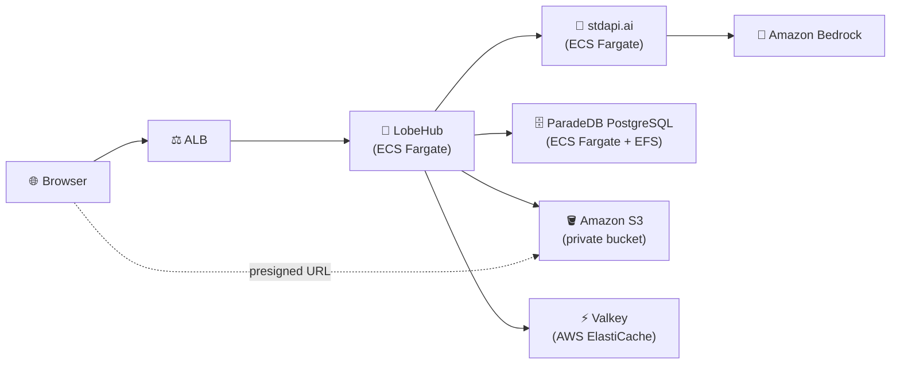

# LobeHub with stdapi.ai - Private AI Chat Platform

This deployment provides [LobeHub](https://lobehub.com/) (formerly LobeChat) powered by stdapi.ai, with chat, vision, image generation, and knowledge-base embeddings enabled out of the box through a single OpenAI-compatible connection.

## About the Postgres extension requirement

LobeHub 2.x dropped its old client-storage (PGlite, browser-only) mode — the current app **only** supports "server DB" mode, and that mode **will not start** without ParadeDB's `pg_search` extension. This is not a degraded-feature trade-off:

- The image sets `DATABASE_DRIVER=node`, which makes `scripts/serverLauncher/startServer.js` run the database migrations at boot and `process.exit(1)` if any of them fails.
- Migration `0090_enable_pg_search.sql` is a single unconditional `CREATE EXTENSION IF NOT EXISTS pg_search;`, and `0093_add_bm25_indexes_with_icu.sql` then creates fourteen `USING bm25` indexes. There is no environment variable, feature flag, or fallback path that skips them — the only `pg_search`-free code path in the repository is the PGlite unit-test harness.

`pg_search` cannot be used on managed AWS Postgres:

- It is absent from both the [Aurora PostgreSQL extension list](https://docs.aws.amazon.com/AmazonRDS/latest/AuroraPostgreSQLReleaseNotes/AuroraPostgreSQL.Extensions.html) and the [RDS for PostgreSQL extension list](https://docs.aws.amazon.com/AmazonRDS/latest/PostgreSQLReleaseNotes/postgresql-extensions.html).
- It additionally requires `shared_preload_libraries = 'pg_search'`, and RDS only allows AWS-vetted modules in that parameter.
- Upstream [lobehub#12899](https://github.com/lobehub/lobehub/issues/12899) confirms the resulting boot failure empirically against another managed Postgres provider.

This sample therefore self-hosts Postgres: the official `paradedb/paradedb` image (Postgres 17 with `pg_search` and `pgvector` preinstalled) runs as its own ECS Fargate task with its data directory on EFS. See `terraform/postgres.tf` for the details.

> ⚠️ **Read this before adapting the sample.** Running PostgreSQL on EFS is fine for evaluating LobeHub and is **not suitable for production data you care about**. EFS is NFS, and PostgreSQL's durability guarantees assume a local block device — the failure mode is silent data corruption, not a clear error. The task is pinned to exactly one instance because two writers against one data directory would corrupt it outright, which also means no high availability and a restart during a write is a real risk.
>
> Postgres runs as a container here purely because `pg_search` is unavailable on RDS. If you take LobeHub to production, run it on something durable — EC2 with EBS, or a managed ParadeDB — and point `DATABASE_URL` at it.

## What This Sets Up

- **Model provider**: stdapi.ai exposed as LobeHub's "OpenAI" provider — unlike Open WebUI, LobeHub uses one base URL/key pair for chat, vision, image generation, and embeddings
- **Default models**: Claude Sonnet 4.5 for chat and vision, Amazon Nova Micro for background tasks (topic naming, translation), Cohere Embed v4 for the knowledge base, Stable Image Core for image generation — all via Amazon Bedrock
- **Database**: self-hosted ParadeDB PostgreSQL (`pg_search` + `pgvector`) on EFS — see above
- **Object storage**: a private Amazon S3 bucket for file/avatar/knowledge-base uploads, accessed through presigned URLs
- **Cache & sessions**: ElastiCache Valkey
- **Security**: KMS encryption for storage and databases, secrets held in SSM `SecureString` parameters (never in plain environment variables)
- **Offline mode**: not applicable — LobeHub's plugin/agent marketplaces reach out to `registry.npmmirror.com` on demand; nothing else calls out

## Prerequisites

1. **AWS Marketplace Subscription**: [Subscribe to stdapi.ai](https://aws.amazon.com/marketplace/pp/prodview-su2dajk5zawpo) - 14-day free trial
2. **OpenTofu**: Install [OpenTofu](https://opentofu.org/docs/intro/install/) >= 1.5
3. **AWS CLI**: Install [AWS CLI v2](https://docs.aws.amazon.com/cli/latest/userguide/getting-started-install.html)
4. **AWS Credentials**: Configure your credentials
   ```bash
   aws sso login --profile your-profile
   ```

> ⚠️ **Requires AWS administrator permissions.** This stack provisions IAM roles and
> policies, KMS keys, ECS/Fargate, ALB, EFS, ElastiCache Valkey, and networking.
> A restricted developer profile will fail during `tofu apply`.
>
> **Strongly recommended:** deploy into a **sandbox / non-production AWS account first**
> to evaluate the stack, then replicate into your target account with scoped-down
> principals once you've validated it.

Before running `tofu apply`, confirm your active AWS identity and region
(the AWS provider reads them from your environment, not from an OpenTofu variable):
```bash
aws sts get-caller-identity
aws configure get region
```

## Get the Code

```bash
git clone https://github.com/stdapi-ai/samples.git
cd samples/getting_started_lobehub
```

<details>
<summary>No git? Download the ZIP instead</summary>

```bash
curl -L https://github.com/stdapi-ai/samples/archive/refs/heads/main.zip -o samples.zip
unzip samples.zip
cd samples-main/getting_started_lobehub
```
</details>

## Deployment

```bash
cd terraform
tofu init
tofu apply
```

After deployment (about 10 minutes for all services to be ready):

```bash
# Get the LobeHub URL
tofu output lobehub_url
```

Open the URL in your browser and register your first account — LobeHub uses real
accounts (email/password by default) rather than a shared access code. The ALB
already restricts access to your current IP, so registration is safe to leave open.

### Manual steps after apply

- **First account**: register through the UI (see above) — there is no
  pre-provisioned admin user.
- **Voice (TTS/STT)**: LobeHub has no server-side env var for the default
  voice provider. In an agent's settings, under Text-to-Speech/Speech-to-Text,
  select **OpenAI Audio** — it reuses the same stdapi.ai connection already
  configured, no extra key needed.
- **Image generation model**: `terraform/lobehub.tf` tags `stability.stable-image-core-v1:1`
  with the `imageOutput` capability in `OPENAI_MODEL_LIST`, which LobeHub's docs
  describe as the mechanism for exposing a model to its "AI Image" tool. This
  wiring was not exercised against a live deployment while building this sample —
  if the model doesn't appear in the AI Image model picker, check the assistant's
  model list settings and re-select it manually.

## Architecture Overview



## Security

### IP Address Restriction

Access is restricted to your current IP address:
- Your public IP is automatically detected during deployment
- If your IP changes, run `tofu apply` to update access

### Object storage is a private S3 bucket

The bucket created by `terraform/s3.tf` is never publicly readable:

- S3 Block Public Access is fully enabled, object ownership is
  `BucketOwnerEnforced` (ACLs disabled entirely), versioning is on, objects are
  encrypted with the deployment's KMS customer managed key, and a bucket policy
  denies any request made without TLS.
- `S3_SET_ACL` is `0` and `S3_PUBLIC_DOMAIN` is unset, which puts LobeHub on its
  presigned-URL code path
  (`apps/server/src/services/file/impls/s3.ts`): the browser uploads with a
  presigned `PUT` and reads with a presigned `GET`, so no object is ever served
  anonymously. A CORS rule allows `GET`/`PUT`/`HEAD` from the app's own origin
  only, because those browser requests are cross-origin.

> ℹ️ **This also fixes a real defect.** Presigned URLs are built from
> `S3_ENDPOINT` and handed to the **browser**, which then talks to that host
> directly — verified here: the upload is a `PUT` straight to
> `https://<bucket>.s3.<region>.amazonaws.com/…`. Earlier revisions of this
> sample pointed `S3_ENDPOINT` at a VPC-internal service-discovery name, which
> no browser can resolve, so every upload, preview and `/f/:id` redirect
> targeted an unreachable host.

### Long-lived IAM user access key

LobeHub passes `S3_ACCESS_KEY_ID`/`S3_SECRET_ACCESS_KEY` explicitly to the AWS
SDK (`apps/server/src/modules/S3/index.ts`) and throws at startup if either is
missing. It never falls back to the default credential chain, and it has no
`S3_SESSION_TOKEN` setting, so the ECS task role and temporary credentials
cannot be used. This sample therefore creates a dedicated IAM user whose only
permissions are `s3:GetObject`, `s3:GetObjectAttributes`, `s3:PutObject`,
`s3:DeleteObject`, `s3:DeleteObjectVersion` and `s3:ListBucket` on that one
bucket, plus `kms:GenerateDataKey`/`kms:Decrypt` on its key — no wildcard
resources. The access key is stored in an SSM `SecureString` parameter like
every other secret here, but it is still a long-lived credential; rotate it (or
replace it once LobeHub supports role-based auth) if you take this to
production.

### `/f/:id` is unauthenticated by design

No bucket setting can change this one: LobeHub's file proxy route
(`src/app/(backend)/f/[id]/route.ts`) deliberately performs no auth check, so
anyone who knows a file id can ask the app for a fresh presigned URL for it.
Upstream documents the reason in the route itself — the URL is embedded in bare
`` tags and shared links that cannot carry cookies. Presigned URLs are
bearer credentials: whoever holds one can read the object until it expires,
after `S3_PREVIEW_URL_EXPIRE_IN` seconds (default `7200`, i.e. 2 hours). Treat
file ids as secrets, and keep the ALB's IP restriction in place.

## Customization

### Region Configuration

To configure your AWS regions and compliance/sovereignty, edit `terraform/main.tf` and
adjust it to your EU or US configuration. Note that the default image-generation
model (Stable Image Core) is currently only available in `us-west-2`.

### Model Configuration

The default models are pre-configured in `terraform/lobehub.tf`:

- `chat_model` — chat and vision (default: `anthropic.claude-sonnet-4-5-20250929-v1:0`)
- `system_agent_model` — background tasks: topic naming, translation, etc. (default: `amazon.nova-micro-v1:0`)
- `embedding_model` — knowledge-base embeddings (default: `cohere.embed-v4:0`)
- `image_gen_model` — image generation (default: `stability.stable-image-core-v1:1`)

Any model can be swapped for another Bedrock model available through stdapi.ai,
as long as it matches the operation's modality. `OPENAI_MODEL_LIST`'s capability
tags (`vision`, `fc`, `imageOutput`, ...) follow LobeHub's
[model list syntax](https://lobehub.com/docs/self-hosting/advanced/model-list);
see [Amazon Bedrock Models](https://docs.aws.amazon.com/bedrock/latest/userguide/models-supported.html)
for regional availability.

For more configuration options, see LobeHub's
[environment variables documentation](https://lobehub.com/docs/self-hosting/environment-variables/basic).

### HTTPS configuration

This sample uses the default load balancer endpoint with HTTP. To enable HTTPS on
a custom domain, set `alb_domain_name` and `alb_route53_zone_name`.

Recommended: create a `terraform.tfvars` file (auto-loaded) to manage these values, for example:
```hcl
alb_domain_name       = "chat.example.com"
alb_route53_zone_name = "example.com"
```

### SSO and authentication

LobeHub supports SSO providers (Google, GitHub, Microsoft, AWS Cognito, ...) and
restricting registration to specific email domains via `AUTH_ALLOWED_EMAILS` /
`AUTH_DISABLE_EMAIL_PASSWORD`. See LobeHub's
[authentication environment variables](https://lobehub.com/docs/self-hosting/environment-variables/auth).

### Database sizing

This sample uses the minimum Fargate task size for Postgres, pinned to exactly
one task (it writes to a single EFS-backed data directory, so running more than
one instance would corrupt it). For production, size the task up and evaluate
whether ParadeDB's own replication options fit your durability requirements —
this sample optimizes for a simple getting-started deployment, not high
availability of the database tier.

### Production hardening

This sample favors low cost and easy cleanup over durability. Before promoting it to production, review these deltas:

- **S3 bucket**: `force_destroy` is on so `tofu destroy` removes the uploads with the stack, and server access logging is not enabled (it would require a second, separately configured log bucket). Turn `force_destroy` off and add access logging for production.
- **IAM access key**: long-lived and never rotated automatically — see the Security section above.
- **ElastiCache Valkey**: single node with no automatic backups. Add replicas or Multi-AZ and enable snapshot retention.
- **ALB**: access logging is not enabled and no WAF is attached. Enable ALB access logs to a dedicated S3 bucket and consider AWS WAF.
- **EFS backups**: the ECS module's default AWS Backup plan covers the Postgres volume; review its retention (`mount_points_backup_retention_days`) for your recovery requirements.

### Microservices interconnections

This sample uses ECS with service discovery to enable communication between microservices.
"Service discovery" uses DNS and round-robin to distribute requests between microservices. This approach is cost-effective and simple.
Using ECS Service Connect or an Application Load Balancer instead can provide better performance and fault tolerance.

## Cleanup

To delete all resources and stop incurring charges:

```bash
cd terraform
tofu destroy
```

**Note**: This will permanently delete all resources, including the Postgres data and every object in the S3 bucket.

## Version Compatibility

- OpenTofu >= 1.5
- stdapi.ai Terraform module ~> 1.0
- AWS Provider >= 6.27.0
- LobeHub `2.2.13`
- ParadeDB `0.25.1-pg17` (Postgres 17)

## Additional Resources

- [LobeHub Documentation](https://lobehub.com/docs/self-hosting/start)
- [stdapi.ai Configuration Guide](https://stdapi.ai/operations_configuration/)
- [Terraform Module Documentation](https://github.com/stdapi-ai/terraform-aws-stdapi-ai)
- [Amazon Bedrock Models](https://docs.aws.amazon.com/bedrock/latest/userguide/models-supported.html)

## Troubleshooting

If you encounter errors, try re-running `tofu apply`.

- **`tofu apply` fails with AccessDenied** — your AWS profile lacks administrator permissions. See Prerequisites above.
- **LobeHub loads but the model list is empty** — the stdapi.ai service behind it may still be starting; wait 2–3 minutes and refresh.
- **`503 Service Unavailable`** — ECS tasks are still starting; health checks take a few minutes.
- **Onboarding shows "Failed to load templates"** — the agent-template picker calls LobeHub's hosted marketplace, which rejects self-hosted deployments. Choose **Skip for now**; nothing else depends on it.
- **A task restarts once on the very first deployment** — when several LobeHub tasks run the database migrations against an empty database at the same time, one can lose a Postgres deadlock (`40P01`) and exit. ECS replaces it and the next attempt succeeds.
- **Chat works but uploads or images fail** — check the LobeHub task logs for S3 errors. `SignatureDoesNotMatch` means `S3_REGION` doesn't match the bucket's region, and a browser CORS error means the origin you're using isn't the one in `APP_URL` (the bucket's CORS rule allows that origin only).

**Full troubleshooting guide:** https://stdapi.ai/operations_troubleshooting/
