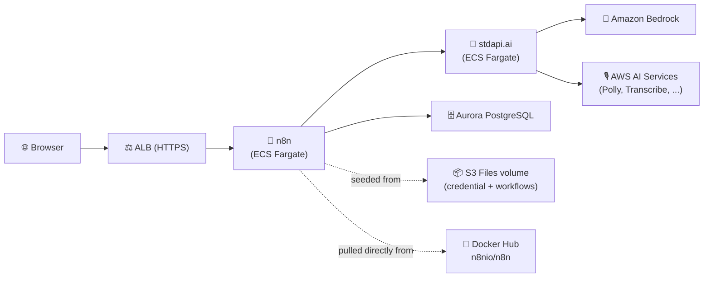

# n8n with stdapi.ai - Preconfigured Workflow Automation

This deployment provides [n8n](https://n8n.io/) powered by stdapi.ai, with a credential and thirteen runnable sample workflows already in place — one per stdapi.ai route family (chat, responses, legacy completions, Anthropic messages, embeddings, moderations, audio speech/transcription/translation, images generation/editing, videos, and files).

**See full documentation:** [n8n Use Case Guide](https://stdapi.ai/use_cases_n8n.md)

## What This Sets Up

- **Workflow engine**: n8n on ECS Fargate, backed by Aurora PostgreSQL
- **Model provider**: stdapi.ai exposed as an OpenAI-compatible and Anthropic-compatible backend, both preconfigured as n8n credentials
- **Sample workflows**: one manually-triggerable workflow per stdapi.ai route family, imported automatically on first start
- **Owner account**: pre-provisioned non-interactively — no first-run signup screen
- **Image supply chain**: the official `n8nio/n8n` image, referenced directly from Docker Hub — nothing is built, pushed, or cached locally
- **Security**: HTTPS-only ALB restricted to your current IP, KMS encryption at rest, no secret ever placed in a plain environment variable

## Prerequisites

1. **AWS Marketplace Subscription**: [Subscribe to stdapi.ai](https://aws.amazon.com/marketplace/pp/prodview-su2dajk5zawpo) - 14-day free trial
2. **OpenTofu**: Install [OpenTofu](https://opentofu.org/docs/intro/install/) >= 1.5 (Terraform works too, but every command below uses the `tofu` binary)
3. **A domain in Route53**: n8n requires HTTPS — it marks its session cookie `Secure`, which every browser then refuses to send back over plain HTTP. You need a domain (or subdomain) whose zone already lives in Route53, so ACM can validate a certificate for it. There is no HTTP-only fallback.
4. **AWS CLI**: Install [AWS CLI v2](https://docs.aws.amazon.com/cli/latest/userguide/getting-started-install.html) - **Required for PostgreSQL database initialization via RDS Data API**
5. **AWS Credentials**: Configure your credentials
   ```bash
   aws sso login --profile your-profile
   ```

> ⚠️ **Requires AWS administrator permissions.** This stack provisions IAM roles and
> policies, KMS keys, ECS/Fargate, ALB, Aurora PostgreSQL, S3, Route53 records,
> ACM certificates, and networking. A restricted developer profile will fail during
> `tofu apply`.
>
> **Strongly recommended:** deploy into a **sandbox / non-production AWS account first**
> to evaluate the stack, then replicate into your target account with scoped-down
> principals once you've validated it.

Before running `tofu apply`, confirm your active AWS identity and region
(the AWS provider reads them from your environment, not from a Terraform variable):
```bash
aws sts get-caller-identity
aws configure get region
```

## Get the Code

```bash
git clone https://github.com/stdapi-ai/samples.git
cd samples/getting_started_n8n
```

<details>
<summary>No git? Download the ZIP instead</summary>

```bash
curl -L https://github.com/stdapi-ai/samples/archive/refs/heads/main.zip -o samples.zip
unzip samples.zip
cd samples-main/getting_started_n8n
```
</details>

## Configuration

Create `terraform/terraform.tfvars` (auto-loaded) with at least the required domain settings:

```hcl
alb_domain_name       = "n8n.example.com"
alb_route53_zone_name = "example.com"

# Optional but recommended: your real email, shown at login.
n8n_owner_email = "you@example.com"
```

## Deployment

```bash
cd terraform
tofu init
tofu apply
```

After deployment (about 15-20 minutes for the database and ECS service to be ready):

```bash
# Get the n8n URL and owner credentials
tofu output n8n_url
tofu output n8n_owner_email
tofu output -raw n8n_owner_password
```

Open the URL in your browser and sign in with those two values — there is no signup screen to click through, the owner account already exists.

## Architecture Overview



## How the Sample Workflows Get There

n8n's task definition runs two containers:

1. **`import`** (non-essential, runs once): imports the stdapi.ai credential (`n8n import:credentials`) and all thirteen sample workflows (`n8n import:workflow --separate`), then exits.
2. **`main`**: the n8n server, started only after `import` exits successfully (`depends_on` / condition `SUCCESS`).

Both the credential file and the workflow files reach the container without a custom image or a bind-mounted host directory: they are declared inline in Terraform (see `terraform/n8n_seed/`) and materialize on a read-only **S3 Files** ECS volume mounted at `/seed`, which the `import` container reads once.

The credential points at stdapi.ai's internal service-discovery address; the workflows are the exact fixtures stdapi.ai's own end-to-end test suite runs against a live gateway (`tests/agentic/workflows/*.json` and `tests/agentic/test_n8n.py` in the main [stdapi.ai repository](https://github.com/stdapi-ai/stdapi.ai)), with placeholders resolved to concrete Bedrock model IDs and prompts instead of test-only values.

**One workflow needs a manual step**: *"stdapi.ai images edits"* transforms an existing image, so it expects a `source.jpg` at `/home/node/.n8n-files/source.jpg` inside the container — a file this sample cannot conjure on your behalf. Upload one yourself (e.g. via `aws ecs execute-command` into the running task, or by adding a Read/Write File node of your own) before running that workflow; every other workflow is runnable as soon as n8n is up.

## Owner Account: Non-Interactive by Design

n8n `2.34.1` (the version this sample pins) supports pre-provisioning the instance owner from environment variables (`N8N_INSTANCE_OWNER_MANAGED_BY_ENV=true`, `N8N_INSTANCE_OWNER_EMAIL`, `N8N_INSTANCE_OWNER_PASSWORD_HASH`, and friends), instead of the interactive first-run signup form older versions required. This sample uses it:

- A random password is generated with `random_password` and hashed with OpenTofu's built-in `bcrypt()` function — no external tool (`htpasswd`, `openssl`, a Node one-liner, ...) is invoked to compute the hash n8n needs.
- The hash goes to n8n as a `secrets` entry (`N8N_INSTANCE_OWNER_PASSWORD_HASH`), never as plain `environment`.
- The plaintext password is a sensitive Terraform output (`n8n_owner_password`); the email is `var.n8n_owner_email` (also a plain output, since it is not a secret).

n8n re-applies this owner account on every container start and rejects UI/API changes to it while `N8N_INSTANCE_OWNER_MANAGED_BY_ENV` stays `true`. If you would rather manage the owner by hand from the UI after the first login, remove that block from `terraform/n8n.tf` and reapply — n8n then falls back to its normal interactive signup.

## Security

### IP Address Restriction

Access is restricted to your current IP address:
- Your public IP is automatically detected during deployment
- If your IP changes, run `tofu apply` to update access

### HTTPS is mandatory, not optional

`alb_domain_name` and `alb_route53_zone_name` have no default and no HTTP fallback — n8n's `Secure` session cookie makes a plain-HTTP deployment unable to keep you logged in.

### Database connection

The connection to Aurora is TLS-encrypted but does not verify the server certificate (`DB_POSTGRESDB_SSL_REJECT_UNAUTHORIZED=false`). The hop never leaves the VPC and is restricted to the service's security group. To verify the certificate chain as well, download the [Amazon RDS CA bundle](https://docs.aws.amazon.com/AmazonRDS/latest/UserGuide/UsingWithRDS.SSL.html), add it to the `seed` mount point's `s3_files_files` in `terraform/n8n.tf`, and point `DB_POSTGRESDB_SSL_CA` at its path.

## Customization

### Region Configuration

To configure your AWS regions and compliance/sovereignty, edit `terraform/main.tf` and
adjust it to your EU or US configuration.

### Model Configuration

The sample workflows default to a small, broadly-available model per route family (e.g. `amazon.nova-micro-v1:0` for chat/responses/completions, `anthropic.claude-haiku-4-5-20251001-v1:0` for Anthropic messages, `amazon.titan-embed-text-v2:0` for embeddings, `stability.stable-image-core-v1:1`/`stability.stable-image-control-structure-v1:0` for images, `luma.ray-v2:0` for video, `amazon.polly-standard` for speech). Edit the model IDs directly in the workflow JSON under `terraform/n8n_seed/workflows/` before your first `tofu apply` — the `import` container only imports each workflow once, so changes after that point are best made from the n8n UI. See [Amazon Bedrock Models](https://docs.aws.amazon.com/bedrock/latest/userguide/models-supported.html) for regional availability.

### n8n features

To enable optional features beyond model configuration, edit `terraform/n8n.tf` and adjust the container's `environment`/`secrets` based on the [n8n environment variable reference](https://docs.n8n.io/hosting/configuration/environment-variables/).

### Database sizing and high availability

This sample uses the minimum Aurora instance size for cost. For production, increase the instance class and add readers or Multi-AZ configuration to enable high availability.

### Production hardening

This sample favors low cost and easy cleanup over durability. Before promoting it to production, review these deltas:

- **Aurora PostgreSQL**: deletion protection is disabled, backups keep the default 1-day retention, and the final snapshot is skipped on destroy (`skip_final_snapshot`). Enable deletion protection, extend backup retention, and take final snapshots.
- **ALB**: access logging is not enabled and no WAF is attached. Enable ALB access logs to a dedicated S3 bucket and consider AWS WAF.
- **Image provenance**: the n8n image is pulled straight from Docker Hub, so nothing scans it on the way in, and anonymous pulls share a per-IP rate limit. Mirroring it into a private registry — an ECR pull-through cache rule, for instance — fixes both, at the cost of a Docker Hub credential to configure first.
- **Binary data storage**: workflow outputs (generated images, audio, video) are written under the EFS-backed `/home/node/.n8n-files` mount or n8n's own ephemeral task storage, depending on the node. For production, configure `N8N_DEFAULT_BINARY_DATA_MODE=s3` with the matching `N8N_EXTERNAL_STORAGE_S3_*` variables so binary data survives independently of any one task.

### Microservices interconnections

This sample uses ECS with service discovery to enable communication between microservices.
"Service discovery" uses DNS and round-robin to distribute requests between microservices. This approach is cost-effective and simple.
Using ECS Service Connect or an Application Load Balancer instead can provide better performance and fault tolerance.

## Cleanup

To delete all resources and stop incurring charges:

```bash
cd terraform
tofu destroy
```

**Note**: This will permanently delete all resources including the database and every workflow/credential/execution it holds.

## Version Compatibility

- OpenTofu >= 1.5 (or Terraform; every command in this README uses `tofu`)
- stdapi.ai Terraform module ~> 1.16
- AWS Provider >= 6.27.0
- n8n `2.34.1`
- ecs-fargate Terraform module ~> 1.4

## Additional Resources

- **[n8n Use Case Guide](https://stdapi.ai/use_cases_n8n.md)** - Complete documentation
- [n8n Documentation](https://docs.n8n.io/)
- [stdapi.ai Configuration Guide](https://stdapi.ai/operations_configuration/)
- [Terraform Module Documentation](https://github.com/stdapi-ai/terraform-aws-stdapi-ai)
- [Amazon Bedrock Models](https://docs.aws.amazon.com/bedrock/latest/userguide/models-supported.html)

## Troubleshooting

If you encounter errors, try re-running `tofu apply`.

- **`tofu apply` fails with AccessDenied** — your AWS profile lacks administrator permissions. See Prerequisites above.
- **`aws_s3files_mount_target` fails to create** — S3 Files, which carries the credential and workflow seed files, is not offered in every availability zone, and no API lists the ones that are. Set `mount_points_s3_files_subnets_ids` on `module "n8n"` in `terraform/n8n.tf` to the subset of `module.vpc.subnets_ids` whose zones support it; the service keeps running across all of them.
- **n8n loads but the workflow list is empty** — the `import` container may still be running, or may have failed; check its logs in CloudWatch (`/ecs/<name-prefix>-n8n/import`) before assuming the seed step succeeded.
- **n8n loads but no models resolve** — the stdapi.ai service behind it may still be starting; wait 2–3 minutes and retry a workflow.
- **`503 Service Unavailable`** — ECS tasks are still starting; health checks take a few minutes, longer on first start (Postgres migrations run before n8n starts serving).
- **Login fails with the output password** — confirm you copied the *raw* output (`tofu output -raw n8n_owner_password`), not the quoted form `tofu output n8n_owner_password` prints.

**Full troubleshooting guide:** https://stdapi.ai/operations_troubleshooting/
