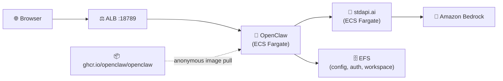

# OpenClaw with stdapi.ai - Autonomous Agent Gateway

This deployment runs [OpenClaw](https://github.com/openclaw/openclaw) — a personal-assistant and coding-agent gateway with a browser Control UI — on ECS Fargate, preconfigured to drive Amazon Bedrock models through stdapi.ai.

**See also:** [Autonomous Agent CLIs](https://stdapi.ai/use_cases_autonomous_agents.md) · [AI Coding Assistants](https://stdapi.ai/use_cases_coding_assistants.md#configuration)

## What This Sets Up

- **Model provider**: stdapi.ai exposed as an OpenAI-compatible API backend, registered as a custom OpenClaw provider (`api: "openai-completions"`)
- **Default model**: `anthropic.claude-fable-5` via Amazon Bedrock
- **Gateway**: bound to `lan` so it is reachable through the ALB, authenticated with a generated token
- **Control UI**: reachable through the ALB, with `gateway.controlUi.allowedOrigins` preset to the ALB's own URL
- **Persistence**: OpenClaw's config, auth material and workspace on EFS, so redeploys and task restarts keep state
- **Security**: KMS encryption at rest, no secrets in plain environment variables, IP-restricted ALB, ECS Exec for pairing
- **No local image build**: the public `ghcr.io/openclaw/openclaw` image is referenced directly, pulled anonymously by Fargate

## Prerequisites

1. **AWS Marketplace Subscription**: [Subscribe to stdapi.ai](https://aws.amazon.com/marketplace/pp/prodview-su2dajk5zawpo) - 14-day free trial
2. **OpenTofu or Terraform**: Install [OpenTofu](https://opentofu.org/docs/intro/install/) or [Terraform](https://www.terraform.io/downloads) >= 1.5
3. **AWS CLI**: Install [AWS CLI v2](https://docs.aws.amazon.com/cli/latest/userguide/getting-started-install.html) - **Required for the device-pairing steps below** (`aws ecs execute-command`)
4. **Session Manager plugin**: Install the [Session Manager plugin for the AWS CLI](https://docs.aws.amazon.com/systems-manager/latest/userguide/session-manager-working-with-install-plugin.html) - required by `aws ecs execute-command`
5. **AWS Credentials**: Configure your credentials
   ```bash
   aws sso login --profile your-profile
   ```

No Docker or Podman is required: the OpenClaw image is never built or pushed from your machine (see [Architecture Overview](#architecture-overview)).

> ⚠️ **Requires AWS administrator permissions.** This stack provisions IAM roles and
> policies, KMS keys, ECS/Fargate, ALB, S3, and networking.
> A restricted developer profile will fail during `tofu apply`.
>
> **Strongly recommended:** deploy into a **sandbox / non-production AWS account first**
> to evaluate the stack, then replicate into your target account with scoped-down
> principals once you've validated it.

Before running `tofu apply`, confirm your active AWS identity and region
(the AWS provider reads them from your environment, not from a Terraform variable):
```bash
aws sts get-caller-identity
aws configure get region
```

## Get the Code

```bash
git clone https://github.com/stdapi-ai/samples.git
cd samples/getting_started_openclaw
```

<details>
<summary>No git? Download the ZIP instead</summary>

```bash
curl -L https://github.com/stdapi-ai/samples/archive/refs/heads/main.zip -o samples.zip
unzip samples.zip
cd samples-main/getting_started_openclaw
```
</details>

## Deployment

```bash
cd terraform
tofu init
tofu apply
```

After deployment (about 10-15 minutes):

```bash
# Get the OpenClaw URL
tofu output openclaw_control_ui_url
```

## Device Pairing (Control UI)

OpenClaw's Control UI requires pairing a device before you can use it from a browser. Run these commands from your machine (they connect into the running task over ECS Exec, so no inbound access to the container is needed beyond what `enable_execute_command` already grants):

```bash
CLUSTER=$(tofu -chdir=terraform output -raw ecs_cluster_name)
TASK=$(aws ecs list-tasks --cluster "$CLUSTER" --query 'taskArns[0]' --output text)

# 1. Start the dashboard inside the container and print a pairing link
aws ecs execute-command --cluster "$CLUSTER" --task "$TASK" --container main \
  --interactive --command "openclaw dashboard --no-open"

# 2. In a second execute-command session, list pending pairing requests
aws ecs execute-command --cluster "$CLUSTER" --task "$TASK" --container main \
  --interactive --command "openclaw devices list"

# 3. Approve the request that matches the browser you paired from
aws ecs execute-command --cluster "$CLUSTER" --task "$TASK" --container main \
  --interactive --command "openclaw devices approve <requestId>"
```

Open `tofu output openclaw_control_ui_url` in your browser to complete pairing once the request is approved. The gateway token (`tofu output -raw openclaw_gateway_token`) is only needed if you pair from a CLI (`openclaw devices approve --url ... --token ...`) instead of a browser.

## Architecture Overview



No image is built or pushed from your machine: the ECS task definition (`terraform/openclaw.tf`) references `ghcr.io/openclaw/openclaw:2026.7.1-slim` directly, and Fargate pulls it from GHCR with no credential.

## Security

### IP Address Restriction

Access is restricted to your current IP address:
- Your public IP is automatically detected during deployment
- If your IP changes, run `tofu apply` to update access

### Agent Sandboxing Is Off

OpenClaw can run agent tool calls inside a nested sandbox (Docker, Podman, SSH or a remote shell) via `agents.defaults.sandbox.mode`. **All of those backends need something Fargate does not expose** — most commonly the host's Docker socket — so this sample sets `agents.defaults.sandbox.mode` to `"off"` in the seeded `openclaw.json`. Tool calls the agent makes therefore run directly inside the `main` container, and this task's own container boundary (no host socket, no elevated Linux capabilities, its own IAM task role) is the only isolation they run under. Do not point this deployment at an agent workload you would not trust to run arbitrary commands inside that container.

### Non-Root Execution and Read-Only Root Filesystem

Both containers run as uid/gid `1000:1000`, matching the image's own built-in `node` user (Security Hub ECS.20). The init container additionally sets `read_only_root_filesystem = true` (Security Hub ECS.5), since it only ever copies one file into an EFS mount. The **main** container does not: OpenClaw's own runtime writes outside its EFS-mounted state directories (npm/plugin caches, `/tmp`) could not be verified against the published image, and this sample does not risk breaking startup by guessing. Revisit this once you have confirmed which paths OpenClaw writes to outside `/home/node/.openclaw` and `/home/node/.config/openclaw`.

## Customization

### Region Configuration

To configure your AWS regions and compliance/sovereignty, edit `terraform/main.tf` and adjust it to your EU or US configuration.

### Model Configuration

The default model is `anthropic.claude-fable-5`, set in `terraform/openclaw.tf` (`local.openclaw_model`) and rendered into the seeded `openclaw.json` (`terraform/openclaw/openclaw.json.tftpl`). To change it or add more models/providers:

- Change `local.openclaw_model` before the first deploy, **or**
- After deploying, edit `/home/node/.openclaw/openclaw.json` directly (via `aws ecs execute-command`) — the init container only seeds this file when it is absent, so your edits survive every redeploy

See [Amazon Bedrock Models](https://docs.aws.amazon.com/bedrock/latest/userguide/models-supported.html) for what is available in your region.

### HTTPS Configuration

This sample uses the default load balancer endpoint with HTTP. To enable HTTPS on a custom domain, set `alb_domain_name` and `alb_route53_zone_name`:
```hcl
alb_domain_name       = "openclaw.example.com"
alb_route53_zone_name = "example.com"
```

### Compute Sizing

`terraform/openclaw.tf` sizes the task at 1 vCPU / 2 GB, a starting point for light agent workloads. Increase `cpu`/`memory` on the `module "openclaw"` block for heavier or more concurrent agent sessions.

### Production Hardening

This sample favors low cost and easy cleanup over durability. Before promoting it to production, review these deltas:

- **Single task, no autoscaling**: `autoscaling_min_capacity`/`autoscaling_max_capacity` are pinned to 1 because OpenClaw keeps per-agent SQLite state on EFS under one gateway process. Scaling beyond one task requires moving that state off the local filesystem first — this sample does not attempt it.
- **ALB**: access logging is not enabled and no WAF is attached. Enable ALB access logs to a dedicated S3 bucket and consider AWS WAF.
- **EFS backups**: the module's default backup plan applies; review retention for your needs.
- **Image provenance**: the OpenClaw image is pulled straight from GHCR, so nothing scans it on the way in. Mirroring it into a private registry — an ECR pull-through cache rule, for instance — restores that gate, at the cost of a GitHub credential to configure first.

### Microservices Interconnections

This sample uses ECS with service discovery to enable communication between microservices. "Service discovery" uses DNS and round-robin to distribute requests between microservices. This approach is cost-effective and simple. Using ECS Service Connect or an Application Load Balancer instead can provide better performance and fault tolerance.

## Cleanup

To delete all resources and stop incurring charges:

```bash
cd terraform
tofu destroy
```

**Note**: This will permanently delete all resources including the S3 Files bucket, and EFS data (OpenClaw's config, auth material and workspace).

## Version Compatibility

- OpenTofu >= 1.5 (or Terraform >= 1.5)
- stdapi.ai Terraform module ~> 1.0
- AWS Provider >= 6.27.0
- ecs-fargate Terraform module ~> 1.4
- OpenClaw `2026.7.1-slim` (verified to pull anonymously from `ghcr.io/openclaw/openclaw`)

## Additional Resources

- **[Autonomous Agent CLIs](https://stdapi.ai/use_cases_autonomous_agents.md)** - OpenClaw and Hermes on Bedrock
- **[AI Coding Assistants — OpenClaw Configuration](https://stdapi.ai/use_cases_coding_assistants.md#configuration)**
- [OpenClaw Documentation](https://docs.openclaw.ai/)
- [stdapi.ai Configuration Guide](https://stdapi.ai/operations_configuration/)
- [Terraform Module Documentation](https://github.com/stdapi-ai/terraform-aws-stdapi-ai)
- [Amazon Bedrock Models](https://docs.aws.amazon.com/bedrock/latest/userguide/models-supported.html)

## Troubleshooting

If you encounter errors, try re-running `tofu apply`.

- **`tofu apply` fails with AccessDenied** — your AWS profile lacks administrator permissions. See Prerequisites above.
- **`aws_s3files_mount_target` fails to create** — S3 Files, which seeds `openclaw.json`, is not offered in every availability zone, and no API lists the ones that are. Set `mount_points_s3_files_subnets_ids` on `module "openclaw"` in `terraform/openclaw.tf` to the subset of `module.vpc.subnets_ids` whose zones support it; the service keeps running across all of them.
- **`aws ecs execute-command` fails with `TargetNotConnectedException`** — wait 30-60s after the task starts for the SSM agent to come up, then retry.
- **Control UI loads but pairing never completes** — confirm you approved the exact `requestId` shown by `openclaw devices list` for the browser session you opened `openclaw_control_ui_url` from.
- **Browser refuses the Control UI connection / CORS-like error** — confirm `tofu output openclaw_control_ui_url` matches the URL in your browser's address bar exactly (scheme, host and port); `gateway.controlUi.allowedOrigins` in the seeded config only allows that one origin.

**Full troubleshooting guide:** https://stdapi.ai/operations_troubleshooting/
