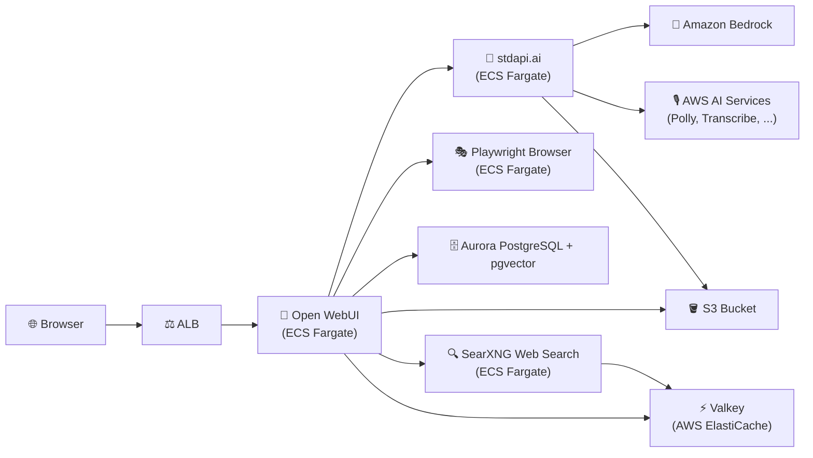

# Open WebUI with stdapi.ai - Complete AI Chat Platform

This deployment provides Open WebUI powered by stdapi.ai, with chat, multimodal generation, speech, web search, scraping, and RAG capabilities enabled out of the box.

**See full documentation:** [Open WebUI Use Case Guide](https://stdapi.ai/use_cases_openwebui/)

## What This Sets Up

This sample keeps most Open WebUI settings at their defaults, and explicitly configures the following:

- **Model provider**: stdapi.ai exposed as an OpenAI-compatible API backend
- **Default models**: Amazon Bedrock models for chat and tasks (Claude, Mistral, Qwen, etc.)
- **Image features**: image generation and editing via Bedrock (using Stability AI models)
- **Speech**: STT (AWS Transcribe) and TTS (AWS Polly)
- **Web search & scraping**: SearXNG and Playwright
- **RAG storage**: Aurora PostgreSQL with pgvector and Cohere embedding models
- **Cache & files**: ElastiCache Valkey and S3
- **Security**: KMS encryption for storage and databases
- **Offline mode**: Open WebUI is configured to only use stdapi.ai, Bedrock, and AWS services

## Prerequisites

1. **AWS Marketplace Subscription**: [Subscribe to stdapi.ai](https://aws.amazon.com/marketplace/pp/prodview-su2dajk5zawpo) - 14-day free trial
2. **Terraform or OpenTofu**: Install [Terraform](https://www.terraform.io/downloads) or [OpenTofu](https://opentofu.org/docs/intro/install/) >= 1.5
3. **Docker or Podman**: Install [Docker Desktop](https://docs.docker.com/get-docker/) or Docker Engine. On Fedora, Podman is supported via the Docker provider socket. **Required to build & copy container images to ECR**
4. **AWS CLI**: Install [AWS CLI v2](https://docs.aws.amazon.com/cli/latest/userguide/getting-started-install.html) - **Required for PostgreSQL database initialization via RDS Data API**
5. **AWS Credentials**: Configure your credentials
   ```bash
   aws sso login --profile your-profile
   ```

> ⚠️ **Requires AWS administrator permissions.** This stack provisions IAM roles and
> policies, KMS keys, ECS/Fargate, ALB, Aurora PostgreSQL, ElastiCache Valkey, ECR,
> S3, and networking. A restricted developer profile will fail during `terraform apply`.
>
> **Strongly recommended:** deploy into a **sandbox / non-production AWS account first**
> to evaluate the stack, then replicate into your target account with scoped-down
> principals once you've validated it.

Before running `terraform apply`, confirm your active AWS identity and region
(the AWS provider reads them from your environment, not from a Terraform variable):
```bash
aws sts get-caller-identity
aws configure get region
```

If you use Podman (common on Fedora), set the Docker provider socket in your `terraform.tfvars`:
```hcl
docker_host = "unix:///var/run/user/1000/podman/podman.sock"
```

## Get the Code

```bash
git clone https://github.com/stdapi-ai/samples.git
cd samples/getting_started_openwebui
```

<details>
<summary>No git? Download the ZIP instead</summary>

```bash
curl -L https://github.com/stdapi-ai/samples/archive/refs/heads/main.zip -o samples.zip
unzip samples.zip
cd samples-main/getting_started_openwebui
```
</details>

## Deployment

```bash
cd terraform
terraform init
terraform apply
```

After deployment (wait 15-30 minutes for services to be ready):

```bash
# Get the Open WebUI URL
terraform output openwebui_url
```

Open the URL in your browser and create your first admin account.

## Architecture Overview


```mermaid
flowchart LR
  Browser["🌐 Browser"] --> ALB["⚖️ ALB"] --> Open_WebUI["💬 Open WebUI<br/>(ECS Fargate)"]
  Open_WebUI --> Stdapi["🤖 stdapi.ai<br/>(ECS Fargate)"]
  Open_WebUI --> Playwright["🎭 Playwright Browser<br/>(ECS Fargate)"]
  Open_WebUI --> Aurora["🗄️ Aurora PostgreSQL + pgvector"]
  Open_WebUI --> SearXNG["🔍 SearXNG Web Search<br/>(ECS Fargate)"]
  Open_WebUI --> Valkey["⚡ Valkey<br/>(AWS ElastiCache)"]
  Open_WebUI --> S3["🪣 S3 Bucket"]
  SearXNG --> Valkey
  Stdapi --> Bedrock["🤖 Amazon Bedrock"]
  Stdapi --> S3
  Stdapi --> AIServices["🎙️ AWS AI Services<br/>(Polly, Transcribe, ...)"]
```

## Security

### IP Address Restriction

Access is restricted to your current IP address:
- Your public IP is automatically detected during deployment
- If your IP changes, run `terraform apply` to update access

## Customization

### Region Configuration

To configure your AWS regions and compliance/sovereignty, edit `terraform/main.tf` and 
adjust it to your EU or US configuration.

### Model Configuration

The default models used in this deployment are pre-configured in `terraform/openwebui.tf`. When selecting models for your deployment, consider:

- **Your needs**: Choose models based on your primary use case (chat, coding, embeddings, image generation, etc.)
- **Regional availability**: Not all models are available in all AWS regions. Check [AWS Bedrock Models](https://docs.aws.amazon.com/bedrock/latest/userguide/models-supported.html) for your region
- **Cost**: Model pricing varies significantly; evaluate your workload and select the most cost-effective option

To customize models, edit `terraform/openwebui.tf` and update the corresponding environment variables:
- `TASK_MODEL_EXTERNAL` — chat and task completion (default: `amazon.nova-micro-v1:0`)
- `RAG_EMBEDDING_MODEL` — text embeddings for RAG (default: `cohere.embed-v4:0`)
- `IMAGE_GENERATION_MODEL` — image generation (default: `stability.stable-image-core-v1:1`)
- `IMAGE_EDIT_MODEL` — image editing (default: `stability.stable-image-control-structure-v1:0`)
- `AUDIO_STT_MODEL` — speech-to-text (default: `amazon.transcribe`)
- `AUDIO_TTS_MODEL` — text-to-speech (default: `amazon.polly-neural`)

**Note**: Amazon Nova Canvas reaches end of life on September 30, 2026. Use `stability.stable-image-core-v1:1` for image generation and `stability.stable-image-control-structure-v1:0` for image editing instead.

For more details, see the [Open WebUI documentation](https://docs.openwebui.com/getting-started/env-configuration).

### Open WebUI features

To enable optional features beyond model configuration, edit `terraform/openwebui.tf` and adjust the corresponding
variables based on the [Open WebUI documentation](https://docs.openwebui.com/getting-started/env-configuration).

### HTTPS configuration

This sample uses the default load balancer endpoint with HTTP. To enable HTTPS on
a custom domain, set `alb_domain_name` and `alb_route53_zone_name`.

Recommended: create a `terraform.tfvars` file (auto-loaded) to manage these values, for example:
```hcl
alb_domain_name       = "chat.example.com"
alb_route53_zone_name = "example.com"
```

### SSO and authentication

Open WebUI supports SSO and advanced authentication methods. This can be configured
with AWS Cognito or other identity providers.

### Database sizing and high availability

This sample uses the minimum Aurora and ElastiCache instance sizes for cost. 
For production, increase the instance class and add readers or Multi-AZ configuration to enable high availability.

### Microservices interconnections

This sample uses ECS with service discovery to enable communication between microservices.
"Service discovery" uses DNS and round-robin to distribute requests between microservices. This approach is cost-effective and simple.
Using ECS Service Connect or an Application Load Balancer instead can provide better performance and fault tolerance.

## Cleanup

To delete all resources and stop incurring charges:

```bash
cd terraform
terraform destroy
```

**Note**: This will permanently delete all resources including S3 buckets, databases, and data.

## Version Compatibility

- Terraform/OpenTofu >= 1.5
- stdapi.ai Terraform module ~> 1.0
- AWS Provider >= 6.27.0
- Open WebUI `v0.11.0` (slim image variant)
- SearXNG `2026.7.26`
- Playwright `1.60.0` (must match the version pinned in the Open WebUI release)

## Additional Resources

- **[Open WebUI Use Case Guide](https://stdapi.ai/use_cases_openwebui/)** - Complete documentation
- [Open WebUI Documentation](https://docs.openwebui.com/)
- [stdapi.ai Configuration Guide](https://stdapi.ai/operations_configuration/)
- [Terraform Module Documentation](https://github.com/stdapi-ai/terraform-aws-stdapi-ai)
- [AWS Bedrock Models](https://docs.aws.amazon.com/bedrock/latest/userguide/models-supported.html)

## Troubleshooting

If you encounter errors, try re-running `terraform apply`.

### Error on ElastiCache creation

The ElastiCache Valkey cache may fail on creation. This issue occurs if there is no available capacity in the availability zone:
```hcl
╷
│ Error: waiting for ElastiCache Replication Group (arn:aws:elasticache:region:account-id:replicationgroup:stdapiai-valkey) create: unexpected state 'create-failed', wanted target 'available'
│ 
│   with aws_elasticache_replication_group.valkey,
│   on valkey.tf line 19, in resource "aws_elasticache_replication_group" "valkey":
│   19: resource "aws_elasticache_replication_group" "valkey" {
│ 
╵
```
The solution is to remove the failed Valkey cache from the ElastiCache console and re-run `terraform apply` to retry.
When deleting the cache, disable backups, then wait until the full deletion is complete before running `terraform apply`.

If the issue persists, you can try changing the `node_type` in `valkey.tf` (for example, from "cache.t4g.micro" to "cache.t3.micro") before retrying.

### Other common issues

- **`terraform apply` fails with AccessDenied** — your AWS profile lacks administrator permissions. See Prerequisites above.
- **Docker/Podman build or push errors** — verify the Docker provider socket (`docker_host` in `terraform.tfvars`) and that `aws ecr get-login-password` works with your profile.
- **Open WebUI loads but model list is empty** — the stdapi.ai service behind it may still be starting; wait 2–3 minutes and refresh.
- **`503 Service Unavailable`** — ECS tasks are still starting; health checks take a few minutes.

**Full troubleshooting guide:** https://stdapi.ai/operations_troubleshooting/
