# Open WebUI with stdapi.ai - Complete AI Chat Platform

This deployment provides Open WebUI powered by stdapi.ai, with chat, multimodal generation, speech, web search, scraping, and RAG capabilities enabled out of the box.

**See full documentation:** [Open WebUI Use Case Guide](https://stdapi.ai/use_cases_openwebui/)

## What This Sets Up

This sample keeps most Open WebUI settings at their defaults, and explicitly configures the following:

- **Model provider**: stdapi.ai exposed as an OpenAI-compatible API backend
- **Default models**: Amazon Bedrock models for chat and tasks (Claude, Mistral, Qwen, etc.)
- **Image features**: image generation and editing via Bedrock (using Stability AI models)
- **Speech**: STT (AWS Transcribe) and TTS (AWS Polly)
- **Web search & scraping**: SearXNG and Playwright
- **RAG storage**: Aurora PostgreSQL with pgvector and Cohere embedding models
- **Cache & files**: ElastiCache Valkey and S3
- **Security**: KMS encryption for storage and databases
- **Offline mode**: Open WebUI is configured to only use stdapi.ai, Bedrock, and AWS services

## Prerequisites

1. **AWS Marketplace Subscription**: [Subscribe to stdapi.ai](https://aws.amazon.com/marketplace/pp/prodview-su2dajk5zawpo) - 14-day free trial
2. **Terraform or OpenTofu**: Install [Terraform](https://www.terraform.io/downloads) or [OpenTofu](https://opentofu.org/docs/intro/install/) >= 1.5
3. **Docker or Podman**: Install [Docker Desktop](https://docs.docker.com/get-docker/) or Docker Engine. On Fedora, Podman is supported via the Docker provider socket. **Required to build & copy container images to ECR**
4. **AWS CLI**: Install [AWS CLI v2](https://docs.aws.amazon.com/cli/latest/userguide/getting-started-install.html) - **Required for PostgreSQL database initialization via RDS Data API**
5. **AWS Credentials**: Configure your credentials
   ```bash
   aws sso login --profile your-profile
   ```

If you use Podman (common on Fedora), set the Docker provider socket in your `terraform.tfvars`:
```hcl
docker_host = "unix:///var/run/user/1000/podman/podman.sock"
```

## Deployment

```bash
cd terraform
terraform init
terraform apply
```

After deployment (wait 15-30 minutes for services to be ready):

```bash
# Get the Open WebUI URL
terraform output openwebui_url
```

Open the URL in your browser and create your first admin account.

## Architecture Overview

```mermaid
flowchart LR
  Browser["🌐 Browser"] --> ALB["⚖️ ALB"] --> Open_WebUI["💬 Open WebUI<br/>(ECS Fargate)"]
  Open_WebUI --> Stdapi["🤖 stdapi.ai<br/>(ECS Fargate)"]
  Open_WebUI --> Playwright["🎭 Playwright Browser<br/>(ECS Fargate)"]
  Open_WebUI --> Aurora["🗄️ Aurora PostgreSQL + pgvector"]
  Open_WebUI --> SearXNG["🔍 SearXNG Web Search<br/>(ECS Fargate)"]
  Open_WebUI --> Valkey["⚡ Valkey<br/>(AWS ElastiCache)"]
  Open_WebUI --> S3["🪣 S3 Bucket"]
  SearXNG --> Valkey
  Stdapi --> Bedrock["🤖 Amazon Bedrock"]
  Stdapi --> S3
  Stdapi --> AIServices["🎙️ AWS AI Services<br/>(Polly, Transcribe, ...)"]
```



## Security

### IP Address Restriction

Access is restricted to your current IP address:
- Your public IP is automatically detected during deployment
- If your IP changes, run `terraform apply` to update access

## Customization

### Open WebUI features

To enable optional features, edit `terraform/openwebui.tf` and adjust the corresponding
variables based on the [Open WebUI documentation](https://docs.openwebui.com/getting-started/env-configuration).

### HTTPS configuration

This sample uses the default load balancer endpoint with HTTP. To enable HTTPS on
a custom domain, set `alb_domain_name` and `alb_route53_zone_name`.

Recommended: create a `terraform.tfvars` file (auto-loaded) to manage these values, for example:
```hcl
alb_domain_name       = "chat.example.com"
alb_route53_zone_name = "example.com"
```

### SSO and authentication

Open WebUI supports SSO and advanced authentication methods. This can be configured
with AWS Cognito or other identity providers.

### Database sizing and high availability

This sample uses the minimum Aurora and ElastiCache instance sizes for cost. 
For production, increase the instance class and add readers or Multi-AZ configuration to enable high availability.

### Microservices interconnections

This sample uses ECS with service discovery to enable communication between microservices.
"Service discovery" uses DNS and round-robin to distribute requests between microservices. This approach is cost-effective and simple.
Using ECS Service Connect or an Application Load Balancer instead can provide better performance and fault tolerance.

## Cleanup

To delete all resources and stop incurring charges:

```bash
cd terraform
terraform destroy
```

**Note**: This will permanently delete all resources including S3 buckets, databases, and data.

## Version Compatibility

- Terraform/OpenTofu >= 1.5
- stdapi.ai Terraform module ~> 1.0
- AWS Provider >= 5.0

## Additional Resources

- **[Open WebUI Use Case Guide](https://stdapi.ai/use_cases_openwebui/)** - Complete documentation
- [Open WebUI Documentation](https://docs.openwebui.com/)
- [stdapi.ai Configuration Guide](https://stdapi.ai/operations_configuration/)
- [Terraform Module Documentation](https://github.com/stdapi-ai/terraform-aws-stdapi-ai)
- [AWS Bedrock Models](https://docs.aws.amazon.com/bedrock/latest/userguide/models-supported.html)

## Troubleshooting

If you encounter errors, try re-running `terraform apply`.

### Error on ElastiCache creation

The ElastiCache Valkey cache may fail on creation. This issue occurs if there is no available capacity in the availability zone:
```hcl
╷
│ Error: waiting for ElastiCache Replication Group (arn:aws:elasticache:region:account-id:replicationgroup:stdapiai-valkey) create: unexpected state 'create-failed', wanted target 'available'
│ 
│   with aws_elasticache_replication_group.valkey,
│   on valkey.tf line 19, in resource "aws_elasticache_replication_group" "valkey":
│   19: resource "aws_elasticache_replication_group" "valkey" {
│ 
╵
```
The solution is to remove the failed Valkey cache from the ElastiCache console and re-run `terraform apply` to retry.
When deleting the cache, disable backups, then wait until the full deletion is complete before running `terraform apply`.

If the issue persists, you can try changing the `node_type` in `valkey.tf` (for example, from "cache.t4g.micro" to "cache.t3.micro") before retrying.
