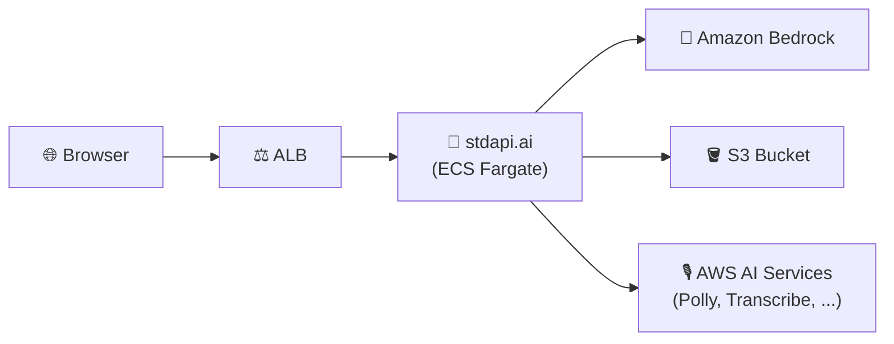

# Production Deployment - Single Region

Production-grade infrastructure with HTTPS, WAF protection, and monitoring without multi-region complexity.

**See full documentation:** [Getting Started Guide](https://stdapi.ai/operations_getting_started/)

## Prerequisites

1. **AWS Marketplace Subscription**: [Subscribe to stdapi.ai](https://aws.amazon.com/marketplace/pp/prodview-su2dajk5zawpo) - 14-day free trial
2. **Terraform or OpenTofu**: Install [Terraform](https://www.terraform.io/downloads) or [OpenTofu](https://opentofu.org/docs/intro/install/) >= 1.5
3. **AWS Credentials**: Configure your credentials
   ```bash
   aws sso login --profile your-profile
   ```

> ⚠️ **Requires AWS administrator permissions.** This stack provisions IAM roles and
> policies, KMS keys, ECS/Fargate, ALB, and networking. A restricted developer
> profile will fail during `terraform apply`.
>
> **Strongly recommended:** deploy into a **sandbox / non-production AWS account first**
> to evaluate the stack, then replicate into your target account with scoped-down
> principals once you've validated it.

Before running `terraform apply`, confirm your active AWS identity and region
(the AWS provider reads them from your environment, not from a Terraform variable):
```bash
aws sts get-caller-identity
aws configure get region
```

## Get the Code

```bash
git clone https://github.com/stdapi-ai/samples.git
cd samples/getting_started_production
```

<details>
<summary>No git? Download the ZIP instead</summary>

```bash
curl -L https://github.com/stdapi-ai/samples/archive/refs/heads/main.zip -o samples.zip
unzip samples.zip
cd samples-main/getting_started_production
```
</details>

## Deployment

```bash
cd terraform
terraform init
terraform apply
```

Get your API credentials:
```bash
terraform output -raw api_key
terraform output api_endpoint
terraform output docs_url
```

## What You Get

- HTTPS with automatic SSL certificate (auto-generated domain)
- Optional WAF protection with rate limiting and anonymous IP blocking
- Optional CloudWatch alarms and monitoring
- Auto-scaling and API key authentication
- Interactive API documentation at `/docs`
- IP-restricted access (your IP only)

## Making Your First API Call

**Wait for service to be ready**: After deployment, the ECS service needs a few minutes to start. The ALB will return `503 Service Unavailable` until the service is healthy. Wait 2-3 minutes before testing.

Test your deployment:

```bash
curl -X POST "$(terraform output -raw api_endpoint)/v1/chat/completions" \
  -H "Content-Type: application/json" \
  -H "Authorization: Bearer $(terraform output -raw api_key)" \
  -d '{
    "model": "amazon.nova-micro-v1:0",
    "messages": [{"role": "user", "content": "Hello! Tell me a joke."}]
  }'
```

Or visit the interactive documentation:
```bash
open "$(terraform output -raw docs_url)"
```

## Architecture Overview



## Security

### IP Address Restriction

Access is restricted to your current IP address:
- Your public IP is automatically detected during deployment
- If your IP changes, run `terraform apply` to update access

**To allow multiple IPs**, edit `alb_ingress_ipv4_cidrs` in `main.tf`:
```hcl
alb_ingress_ipv4_cidrs = [
  "203.0.113.0/32",  # Your office IP
  "198.51.100.0/32"  # Additional IP
]
```

## Customization

The configuration works out of the box. To customize (optional):

- **Custom domain**: Uncomment `alb_domain_name` in `main.tf`
- **SNS notifications**: Uncomment `sns_topic_arn` in `main.tf`
- **Disable /docs**: Set `enable_docs = false` in `main.tf`

## Cleanup

To delete all resources and stop incurring charges:

```bash
cd terraform
terraform destroy
```

**Note**: This will permanently delete all resources including S3 buckets and data.

## Version Compatibility

- Terraform/OpenTofu >= 1.5
- stdapi.ai Terraform module ~> 1.0
- AWS Provider >= 4.0

## Troubleshooting

Most common first-deployment issues:

- **`503 Service Unavailable` for 2–3 minutes after apply** — ECS service is still starting; wait a few minutes and retry.
- **Browser TLS warning on `docs_url`** — the auto-generated `*.elb.amazonaws.com` domain has no trusted certificate; safe to bypass for testing. Use `alb_domain_name` for a custom domain.
- **`terraform apply` fails with AccessDenied on IAM/KMS/ECS** — your AWS profile lacks administrator permissions. See Prerequisites above.
- **`403 Unauthorized` on API calls** — pass the key in the `Authorization: Bearer <key>` (OpenAI) or `x-api-key` (Anthropic) header.
- **`404 Not Found` for a model** — list every discovered model with full details via `GET /search_models` (the default model-discovery endpoint), or filter by capability with query parameters (`?route=/v1/chat/completions&streaming=true`). `GET /v1/models` is also available for strict OpenAI SDK compatibility. See https://stdapi.ai/api_search_models/.

**Full troubleshooting guide:** https://stdapi.ai/operations_troubleshooting/

## Additional Resources

- [Getting Started Guide](https://stdapi.ai/operations_getting_started/)
- [Configuration Guide](https://stdapi.ai/operations_configuration/)
- [Terraform Module Documentation](https://github.com/stdapi-ai/terraform-aws-stdapi-ai)
- [API Reference](https://stdapi.ai/api_overview/)
