# Production Deployment - Multi-Region GDPR Compliant

Enterprise-ready deployment with multi-region Bedrock support and GDPR compliance across EU regions.

**See full documentation:** [Getting Started Guide](https://stdapi.ai/operations_getting_started/)

## Prerequisites

1. **AWS Marketplace Subscription**: [Subscribe to stdapi.ai](https://aws.amazon.com/marketplace/pp/prodview-su2dajk5zawpo) - 14-day free trial
2. **Terraform or OpenTofu**: Install [Terraform](https://www.terraform.io/downloads) or [OpenTofu](https://opentofu.org/docs/intro/install/) >= 1.5
3. **AWS Credentials**: Configure your credentials
   ```bash
   aws sso login --profile your-profile
   ```

## Deployment

```bash
cd terraform
terraform init
terraform apply
```

Get your API credentials:
```bash
terraform output -raw api_key
terraform output api_endpoint
terraform output docs_url
```

## What You Get

- Multi-region Bedrock support (4 EU regions: Paris, Ireland, Frankfurt, Stockholm)
- Access to wider range of models across regions
- Regional S3 buckets for multimodal operations
- GDPR-compliant: EU data residency, no global cross-region inference
- HTTPS with automatic SSL certificate (auto-generated domain)
- WAF protection with rate limiting and anonymous IP blocking
- Optional CloudWatch alarms and monitoring
- Auto-scaling and API key authentication
- Interactive API documentation at `/docs`
- IP-restricted access (your IP only)

## Making Your First API Call

**Wait for service to be ready**: After deployment, the ECS service needs a few minutes to start. The ALB will return `503 Service Unavailable` until the service is healthy. Wait 2-3 minutes before testing.

Test your deployment:

```bash
curl -X POST "$(terraform output -raw api_endpoint)/v1/chat/completions" \
  -H "Content-Type: application/json" \
  -H "Authorization: Bearer $(terraform output -raw api_key)" \
  -d '{
    "model": "amazon.nova-micro-v1:0",
    "messages": [{"role": "user", "content": "Hello! Tell me a joke."}]
  }'
```

Or visit the interactive documentation:
```bash
open "$(terraform output -raw docs_url)"
```

## Architecture Overview

```mermaid
flowchart LR
  Browser["🌐 Browser"] --> ALB["⚖️ ALB<br/>(HTTPS + WAF)"] --> Stdapi["🤖 stdapi.ai<br/>(ECS Fargate)"]
  Stdapi --> BedrockParis["🤖 Bedrock<br/>eu-west-3 Paris"]
  Stdapi --> BedrockIreland["🤖 Bedrock<br/>eu-west-1 Ireland"]
  Stdapi --> BedrockFrankfurt["🤖 Bedrock<br/>eu-central-1 Frankfurt"]
  Stdapi --> BedrockStockholm["🤖 Bedrock<br/>eu-north-1 Stockholm"]
  Stdapi --> S3Paris["🪣 S3 Paris"]
  Stdapi --> S3Ireland["🪣 S3 Ireland"]
  Stdapi --> S3Frankfurt["🪣 S3 Frankfurt"]
  Stdapi --> S3Stockholm["🪣 S3 Stockholm"]
  Stdapi --> AIServices["🎙️ AWS AI Services<br/>(Polly, Transcribe, ...)"]
```



## When to Use This Example

- Access to wider range of models across multiple EU regions
- Multi-region Bedrock with multimodal features
- GDPR or data residency compliance requirements
- Enterprise deployments requiring EU data sovereignty

For simpler single-region deployment, see the `getting_started_production` example.

## Security

### IP Address Restriction

Access is restricted to your current IP address:
- Your public IP is automatically detected during deployment
- If your IP changes, run `terraform apply` to update access

**To allow multiple IPs**, edit `alb_ingress_ipv4_cidrs` in `main.tf`:
```hcl
alb_ingress_ipv4_cidrs = [
  "203.0.113.0/32",  # Your office IP
  "198.51.100.0/32"  # Additional IP
]
```

## Customization

The configuration works out of the box with EU regions. To customize (optional):

- **Custom domain**: Uncomment `alb_domain_name` in `main.tf`
- **SNS notifications**: Uncomment `sns_topic_arn` in `main.tf`
- **Different regions**: Edit `aws_bedrock_regions` and provider configurations in `main.tf`
- **Disable /docs**: Set `enable_docs = false` in `main.tf`

## Cleanup

To delete all resources and stop incurring charges:

```bash
cd terraform
terraform destroy
```

**Note**: This will permanently delete all resources including regional S3 buckets and data.

## Version Compatibility

- Terraform/OpenTofu >= 1.5
- stdapi.ai Terraform module ~> 1.0
- AWS Provider >= 4.0

## Additional Resources

- [Getting Started Guide](https://stdapi.ai/operations_getting_started/)
- [Configuration Guide](https://stdapi.ai/operations_configuration/)
- [Terraform Module Documentation](https://github.com/stdapi-ai/terraform-aws-stdapi-ai)
- [API Reference](https://stdapi.ai/api_overview/)
