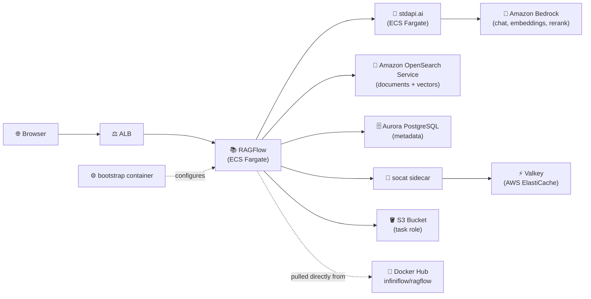

# RAGFlow with stdapi.ai - Preconfigured Retrieval-Augmented Generation

This deployment provides [RAGFlow](https://ragflow.io/) powered by stdapi.ai, with its chat, embedding and reranking models already bound to Amazon Bedrock through the stdapi.ai gateway — no model-provider wizard to click through after the first login.

## What This Sets Up

- **RAG platform**: RAGFlow on ECS Fargate, one application container running the web server, the task executor and the data-source sync loop
- **Model provider**: stdapi.ai registered as a RAGFlow model provider and bound as the tenant's chat, embedding and rerank defaults, non-interactively
- **Document & vector store**: Amazon OpenSearch Service, a managed VPC domain with fine-grained access control
- **Metadata database**: Aurora PostgreSQL Serverless v2, initialized over the RDS Data API
- **Cache & task queue**: ElastiCache for Valkey, reached over TLS through a sidecar
- **Object storage**: Amazon S3, accessed with the ECS task role — no IAM user, no static keys
- **Superuser account**: pre-provisioned from a generated password, with self-registration closed
- **Image supply chain**: the official `infiniflow/ragflow` image, referenced directly from Docker Hub — nothing is built, pushed, or cached locally
- **Security**: KMS encryption at rest everywhere, TLS in transit to every backing service, ALB restricted to your current IP, no secret ever placed in a plain environment variable

## Prerequisites

1. **AWS Marketplace Subscription**: [Subscribe to stdapi.ai](https://aws.amazon.com/marketplace/pp/prodview-su2dajk5zawpo) - 14-day free trial
2. **OpenTofu**: Install [OpenTofu](https://opentofu.org/docs/intro/install/) >= 1.5 (Terraform works too, but every command below uses the `tofu` binary)
3. **AWS CLI**: Install [AWS CLI v2](https://docs.aws.amazon.com/cli/latest/userguide/getting-started-install.html) - **Required for PostgreSQL database initialization via RDS Data API**
4. **AWS Credentials**: Configure your credentials
   ```bash
   aws sso login --profile your-profile
   ```

> ⚠️ **Requires AWS administrator permissions.** This stack provisions IAM roles and
> policies, KMS keys, ECS/Fargate, ALB, Amazon OpenSearch Service, Aurora PostgreSQL,
> ElastiCache Valkey, S3, and networking. A restricted developer profile will fail
> during `tofu apply`.
>
> **Strongly recommended:** deploy into a **sandbox / non-production AWS account first**
> to evaluate the stack, then replicate into your target account with scoped-down
> principals once you've validated it.

Before running `tofu apply`, confirm your active AWS identity and region
(the AWS provider reads them from your environment, not from an OpenTofu variable):
```bash
aws sts get-caller-identity
aws configure get region
```

## Get the Code

```bash
git clone https://github.com/stdapi-ai/samples.git
cd samples/getting_started_ragflow
```

<details>
<summary>No git? Download the ZIP instead</summary>

```bash
curl -L https://github.com/stdapi-ai/samples/archive/refs/heads/main.zip -o samples.zip
unzip samples.zip
cd samples-main/getting_started_ragflow
```
</details>

## Deployment

```bash
cd terraform
tofu init
tofu apply
```

After deployment (about 30 minutes, most of it the OpenSearch domain and the first RAGFlow start):

```bash
# Get the RAGFlow URL and superuser credentials
tofu output ragflow_url
tofu output ragflow_superuser_email
tofu output -raw ragflow_superuser_password
```

Open the URL in your browser and sign in with those two values. There is no signup screen and no model-provider dialog: create a knowledge base, upload a document, and it parses with the models already selected.

## Architecture Overview



## How the Model Provider Gets There

Since the v0.26 model-provider refactor, RAGFlow keeps model credentials in its own database tables, not in `service_conf.yaml`: the `user_default_llm` block only names models, so naming one without a provider makes RAGFlow's superuser initialization fail on its post-creation sanity chat. This sample therefore leaves `user_default_llm` out entirely and provisions the provider over the REST API instead.

The task definition runs three containers:

1. **`valkey-tls`**: a [socat](https://www.dest-unreach.org/socat/) TLS terminator listening on `127.0.0.1:6379` and forwarding to the encrypted ElastiCache endpoint.
2. **`main`**: RAGFlow itself, started only after `valkey-tls` is healthy. It copies this deployment's configuration template into place, then runs the image entry point with `--init-superuser`.
3. **`bootstrap`** (non-essential, runs once): waits for `GET /api/v1/system/healthz`, logs in as the superuser, registers the providers, creates three provider instances pointed at stdapi.ai, binds the tenant defaults, and exits.

Three instances are needed because RAGFlow derives each model's endpoint — and each model's HTTP client — from the provider and instance it belongs to:

| Model | Provider | Instance | Base URL |
| --- | --- | --- | --- |
| chat | `OpenAI-API-Compatible` | `stdapi-ai` | `…/v1` |
| rerank | `OpenAI-API-Compatible` | `stdapi-ai-rerank` | `…/cohere/v2` |
| embedding | `OpenAI-API-Compatible` | `stdapi-ai-embed` | `…/v1` |

Reranking gets its own instance because it is served on the Cohere-compatible routes rather than the OpenAI ones. Chat and embeddings share those routes but still take one instance each, because an instance carries a single model.

RAGFlow's `OpenAI-API-Compatible` embedding client adds a `drop_params: true` field to the request body, a convention borrowed from LiteLLM. stdapi.ai drops that field instead of forwarding it to Amazon Bedrock as a model parameter, so no special provider is needed. Against a gateway older than 1.16 the field reaches Bedrock, which answers `ValidationException` and the document fails to parse.

Both the configuration template and the bootstrap script reach the containers without a custom image or a bind mount: they are declared in OpenTofu (see `terraform/ragflow_conf/`) and materialize on a read-only **S3 Files** ECS volume mounted at `/seed`.

Creating a provider instance makes RAGFlow call the model for real to verify the API key, so the bootstrap container retries until the stdapi.ai gateway answers. Every step is idempotent — it re-runs harmlessly on each task start.

## Security

### IP Address Restriction

Access is restricted to your current IP address:
- Your public IP is automatically detected during deployment
- If your IP changes, run `tofu apply` to update access

### OpenSearch certificates are not verified by the client

RAGFlow's OpenSearch client hardcodes `verify_certs=False` (`rag/utils/opensearch_conn.py`). The connection is encrypted — the domain enforces HTTPS, TLS 1.2 with perfect forward secrecy, node-to-node encryption and encryption at rest — but RAGFlow does not validate the domain's certificate chain, and there is no configuration switch to make it. The mitigations are that the domain has no public endpoint at all (it lives in the VPC's private subnets) and that its security group only admits the RAGFlow task. This is stated here rather than hidden: it is a property of the application, not of the deployment.

For the same reason the domain uses **fine-grained access control with an internal master user** (a username and password) rather than IAM: RAGFlow signs no SigV4 request. Requests authenticated by the internal user database carry no IAM principal, so the domain access policy cannot restrict by principal without rejecting them — authorization is enforced by fine-grained access control, and reachability by the VPC placement and the security group.

### ElastiCache is encrypted, and RAGFlow cannot speak TLS

RAGFlow builds its Redis client without any `ssl` parameter (`rag/utils/redis_conn.py`), so it cannot connect to an in-transit-encrypted cluster directly — and ElastiCache only offers AUTH tokens on encrypted clusters. Rather than turning encryption off, the task runs a pinned `alpine/socat` sidecar that accepts the plaintext loopback connection and re-opens it as TLS, verifying the ElastiCache certificate against the system trust store. The cluster keeps in-transit encryption, encryption at rest and its AUTH token; the plaintext hop never leaves the task's own network namespace.

### Database connection

The connection to Aurora uses `sslmode=require`: encrypted, without verifying the server certificate chain. The hop never leaves the VPC and is restricted to the service's security group. To verify the chain as well, download the [Amazon RDS CA bundle](https://docs.aws.amazon.com/AmazonRDS/latest/UserGuide/UsingWithRDS.SSL.html), add it to the `seed` mount point's `s3_files_files` in `terraform/ragflow.tf`, and set `sslmode: 'verify-full'` plus `sslrootcert` in `terraform/ragflow_conf/service_conf.yaml.template`.

### Object storage

RAGFlow's S3 backend passes no credentials when none are configured, so boto3 falls back to its default chain and picks up the ECS task role. The sample therefore creates no IAM user and no static access key. The task role may only `GetObject`/`PutObject`/`DeleteObject` under the `ragflow/` prefix of the stdapi.ai bucket, plus `ListBucket` on the bucket itself (RAGFlow calls `HeadBucket` before writes) and the matching KMS operations.

### Secrets

Every password, token and API key reaches a container through the ECS `secrets` mechanism, which stores them as SSM parameters and injects them at task start. None is present in a plain environment variable, and none is written into the configuration file that sits on the S3 Files volume — that file only carries `${VARIABLE}` placeholders which the image entry point expands at runtime.

## Known Limitations

These are properties of RAGFlow `v0.26.4` with the OpenSearch document engine, not of this deployment:

- **Agent Memory is unavailable.** RAGFlow only wires a message store for the Elasticsearch, Infinity, OceanBase and SeekDB engines; with `DOC_ENGINE=opensearch` it stays unset (`common/settings.py`), so the memory feature raises when used. Startup is unaffected.
- **The Agent "Code" component is unavailable.** It needs RAGFlow's sandbox executor, which requires a Docker socket and gVisor — neither exists on Fargate. `SANDBOX_ENABLED` is left unset.
- **Pagerank and the resume parser** branch on Elasticsearch upstream and do not apply on the OpenSearch backend.
- **No upstream CI covers the OpenSearch engine.** RAGFlow's GitHub workflows exercise `elasticsearch` and `infinity` only, which is why this sample pins an exact image tag instead of a floating one.
- **Hybrid search** (BM25 + KNN) requires OpenSearch >= 2.10 and the `cluster:admin/search/pipeline/put` privilege. RAGFlow provisions the pipeline itself at start-up and silently degrades to vector-only if it cannot. See Troubleshooting below for how to confirm which mode you got.

## Customization

### Region Configuration

To configure your AWS regions and compliance/sovereignty, edit `terraform/main.tf` and
adjust it to your EU or US configuration.

### Model Configuration

The models bound to the RAGFlow tenant are declared in `locals` at the top of `terraform/main.tf`:

- `ragflow_chat_model` — chat and answer synthesis (default: `amazon.nova-lite-v1:0`)
- `ragflow_embedding_model` — text embeddings for indexing and retrieval (default: `cohere.embed-v4:0`)
- `ragflow_rerank_model` — reranking of retrieved chunks (default: `cohere.rerank-v3-5:0`)

When selecting models, consider:

- **Your needs**: chat quality, embedding dimensionality and language coverage all drive retrieval quality
- **Regional availability**: not all models are available in all AWS regions. Check [Amazon Bedrock Models](https://docs.aws.amazon.com/bedrock/latest/userguide/models-supported.html) for your region
- **Cost**: model pricing varies significantly; evaluate your workload and select the most cost-effective option

**Note**: Amazon Bedrock reranking is available in only a few regions (`us-west-2` and `eu-central-1` carry both rerank models). The default region list in `terraform/main.tf` includes one of them, and stdapi.ai fails over to it automatically. If you narrow `aws_bedrock_regions`, keep a reranking region in the list.

**Changing the embedding model after documents are indexed requires re-parsing them**: RAGFlow stores the vector dimension in the knowledge base and rejects a mismatch.

**This sample needs stdapi.ai 1.16 or later**, which is what the `~> 1.16` module constraint pins. Earlier releases forward RAGFlow's `drop_params` field to Bedrock, and every embedding call fails with a `ValidationException`.

### RAGFlow features

To enable optional features beyond model configuration, edit `terraform/ragflow.tf` and adjust the `main` container's `environment` based on the [RAGFlow configuration reference](https://ragflow.io/docs/dev/configurations).

### HTTPS configuration

This sample uses the default load balancer endpoint with HTTP. To enable HTTPS on
a custom domain, set `alb_domain_name` and `alb_route53_zone_name`.

Recommended: create a `terraform.tfvars` file (auto-loaded) to manage these values, for example:
```hcl
alb_domain_name       = "ragflow.example.com"
alb_route53_zone_name = "example.com"
ragflow_superuser_email = "you@example.com"
```

### Database and search sizing

This sample uses the minimum Aurora, ElastiCache and OpenSearch instance sizes for cost.
For production, increase the instance classes and add readers, Multi-AZ or additional
OpenSearch data nodes to enable high availability.

### Production hardening

This sample favors low cost and easy cleanup over durability. Before promoting it to production, review these deltas:

- **Amazon OpenSearch Service**: a single data node in a single availability zone, with no dedicated master nodes, no automated snapshot retention beyond the service default, and no audit or slow-log publishing. Move to at least three data nodes across three availability zones with dedicated masters, and enable log publishing to CloudWatch Logs.
- **Aurora PostgreSQL**: deletion protection is disabled, backups keep the default 1-day retention, and the final snapshot is skipped on destroy (`skip_final_snapshot`). Enable deletion protection, extend backup retention, and take final snapshots.
- **ElastiCache Valkey**: single node with no automatic backups. Add replicas or Multi-AZ and enable snapshot retention.
- **ALB**: access logging is not enabled and no WAF is attached. Enable ALB access logs to a dedicated S3 bucket and consider AWS WAF.
- **Scaling**: the service runs a single task. RAGFlow's web server and task executor share that task, so parsing throughput and request serving compete for the same CPU. Split them (`--disable-taskexecutor` / `--disable-webserver`) into separate services before scaling either one.

### Microservices interconnections

This sample uses ECS with service discovery to enable communication between microservices.
"Service discovery" uses DNS and round-robin to distribute requests between microservices. This approach is cost-effective and simple.
Using ECS Service Connect or an Application Load Balancer instead can provide better performance and fault tolerance.

## Cleanup

To delete all resources and stop incurring charges:

```bash
cd terraform
tofu destroy
```

**Note**: This will permanently delete all resources including the OpenSearch domain, the database, and every knowledge base and document they hold.

One thing is deliberately left behind: the `AWSServiceRoleForAmazonOpenSearchService` service-linked role. It is account-wide, shared with every other OpenSearch domain, and costs nothing.

## Expected Log Noise

These messages appear on every start and are harmless, all verified on a real deployment:

- `CRITICAL:root:Failed to add POSTGRES.<table> column <name>, error: column ... already exists` — dozens of lines from the `main` container. RAGFlow applies its schema migrations by attempting every `ALTER TABLE ADD COLUMN` unconditionally and logging the ones the database already has. The schema is correct afterwards.
- `UserWarning: Connecting to https://vpc-...es.amazonaws.com:443 using SSL with verify_certs=False is insecure` and the matching `InsecureRequestWarning`. This is RAGFlow's hardcoded OpenSearch client setting; see "Security" above.
- `socat[...] W OpenSSL: Warning: this implementation does not check CRLs` in the `valkey-tls` container. socat validates the ElastiCache certificate chain but does not fetch revocation lists; the adjacent `trusting certificate, commonName matches` line confirms the check that matters passed.
- `WARNING Load term.freq FAIL!` — RAGFlow's optional term-frequency resource is not shipped in the image.
- `WARNING RedisDB.queue_info te.0.common got exception: no such key` and `RedisDB.get_unacked_iterator queue te.0.common doesn't exist` — the task executor inspects its Redis stream before any document has been queued.
- `WARNING PostgreSQL connection issue (attempt 1/5): connection already closed` — Aurora Serverless v2 drops idle connections; RAGFlow's pool reconnects on the next attempt.
- `Exception ignored in: <async_generator object AsyncStream.__stream__ ...>` with `sniffio ... AsyncLibraryNotFoundError` — the OpenAI client's streaming generator being finalized by the garbage collector after its event loop is gone, at the end of a completed chat.

## Version Compatibility

- OpenTofu >= 1.5 (or Terraform; every command in this README uses `tofu`)
- stdapi.ai Terraform module ~> 1.16
- AWS Provider >= 6.27.0
- RAGFlow `v0.26.4` (x86_64 only — the task sets its CPU architecture explicitly)
- Amazon OpenSearch Service `2.19` (the engine version RAGFlow is tested against upstream)
- socat `1.8.0.3` (`alpine/socat`)
- ecs-fargate Terraform module ~> 1.4

## Additional Resources

- [RAGFlow Documentation](https://ragflow.io/docs/dev/)
- [stdapi.ai Configuration Guide](https://stdapi.ai/operations_configuration/)
- [Terraform Module Documentation](https://github.com/stdapi-ai/terraform-aws-stdapi-ai)
- [Amazon Bedrock Models](https://docs.aws.amazon.com/bedrock/latest/userguide/models-supported.html)
- [Amazon OpenSearch Service Documentation](https://docs.aws.amazon.com/opensearch-service/latest/developerguide/what-is.html)

## Troubleshooting

If you encounter errors, try re-running `tofu apply`.

### `AccessDeniedException: The specified KMS key does not exist or is not allowed`

A first `tofu apply` sometimes fails this way while creating a CloudWatch log group. It is AWS-side eventual consistency between the KMS key policy update and CloudWatch Logs; re-running `tofu apply` resolves it.

### The service-linked role for Amazon OpenSearch Service

A VPC domain cannot be created until the account has the `AWSServiceRoleForAmazonOpenSearchService` role. `tofu apply` creates it if it is missing, using the AWS CLI, and leaves it in place on `tofu destroy` because it is account-wide and shared with any other domain. Creating it needs `iam:CreateServiceLinkedRole`, which the administrator permissions listed in the prerequisites already include.

### Confirming whether hybrid search is enabled

RAGFlow provisions its `ragflow_hybrid_pipeline` search pipeline on start-up and falls back to vector-only search if the call is rejected. Check the `main` container log:

```bash
aws logs tail /ecs/<name-prefix>-ragflow/main --since 1h | grep -i "hybrid search"
```

`OpenSearch hybrid search enabled via pipeline 'ragflow_hybrid_pipeline'` means BM25 + KNN. `Could not create OpenSearch search pipeline` means vector-only.

### The model provider is missing after login

Read the `bootstrap` container's log. It prints every step and the tenant's resulting default models:

```bash
aws logs tail /ecs/<name-prefix>-ragflow/bootstrap --since 1h
```

The most common cause of a failure there is the stdapi.ai service not yet answering: creating a provider instance verifies the API key by calling the model for real. The container retries for 15 minutes before giving up.

### Other common issues

- **`tofu apply` fails with AccessDenied** — your AWS profile lacks administrator permissions. See Prerequisites above.
- **`503 Service Unavailable`** — ECS tasks are still starting. The first start creates the database schema and seeds RAGFlow's agent templates, which takes several minutes.
- **Document parsing stays at 0%** — the task executor shares the container with the web server; check the `main` log for `task_executor` errors, most often a model call failing at the gateway.
- **Login fails with the output password** — confirm you copied the *raw* output (`tofu output -raw ragflow_superuser_password`), not the quoted form `tofu output ragflow_superuser_password` prints.
- **`aws_s3files_mount_target` fails to create** — S3 Files, which carries RAGFlow's configuration, is not offered in every availability zone, and no API lists the ones that are. Set `mount_points_s3_files_subnets_ids` on `module "ragflow"` in `terraform/ragflow.tf` to the subset of `module.vpc.subnets_ids` whose zones support it; the service keeps running across all of them.

**Full troubleshooting guide:** https://stdapi.ai/operations_troubleshooting/
